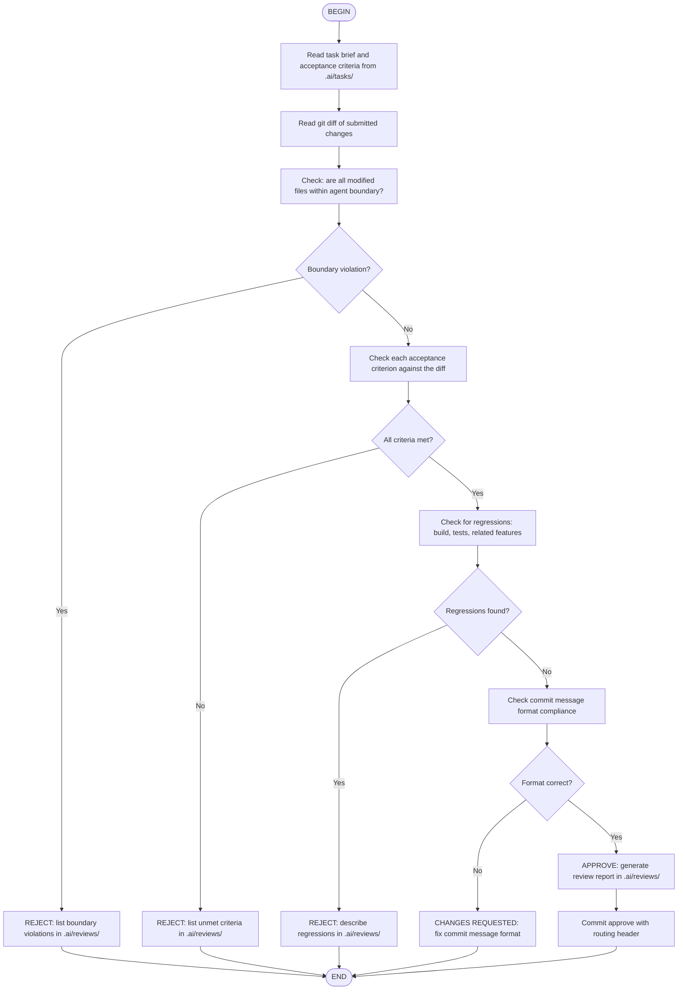

## Flow Steps Detail

### Step: Read task brief
- Open `.ai/tasks/TASK-XXX.md`
- Extract acceptance criteria checklist
- Note the assigned agent and file scope

### Step: Read git diff
- Run `git diff pre-mortal..<agent>/<task-id>`
- Identify all modified, added, and deleted files
- Note the scope of changes

### Step: Check boundaries
- Compare modified files against AGENTS.md ownership
- Reference `.ai/boundaries.md` for the complete map
- Flag any file outside the agent's domain

### Step: Check acceptance criteria
- Go through each criterion one by one
- Mark as met or unmet
- For unmet criteria, note what's missing

### Step: Check for regressions
- Verify build passes: `npm run build`
- Verify tests pass: `npm run test`
- Verify type check passes: `npx tsc --noEmit`
- Check related features still work

### Step: Check commit message format
- Verify header: `[AGENT:x] [ACTION:submit] [TASK:z]`
- Verify AGENT value matches the submitting agent
- Verify TASK value matches the task being reviewed

### Step: Generate review report
- Write to `.ai/reviews/TASK-XXX-review.md`
- Include checklist, findings, feedback, and verdict
- Use template from `.ai/templates/review.md`

## Verdict Outcomes

| Verdict | Commit | Next Action |
|---------|--------|-------------|
| APPROVE | `[AGENT:kimi] [ACTION:approve] [TASK:X]` | Merge to pre-mortal |
| CHANGES REQUESTED | `[AGENT:kimi] [ACTION:reject] [TASK:X]` | Agent fixes and re-submits |
| REJECT | `[AGENT:kimi] [ACTION:reject] [TASK:X]` | Task re-scoped or reassigned |

## Advanced Review Patterns

### Dynamic Reviewer Subagents

For specialized reviews, create a dynamic subagent at runtime:

```python
CreateSubagent(name="security-reviewer", system_prompt="<security review prompt>")
Task(subagent_name="security-reviewer", prompt="Review TASK-X for security issues...")
```

Templates available in `.agents/subagents/` (debugger, performance, docs, test-generator).

### Agent Swarm for Batch Reviews

At sprint end, dispatch multiple reviewer subagents in parallel:

```python
# Review 5 tasks simultaneously (K2.5 supports up to 100 sub-agents)
for task in tasks:
    Task(subagent_name="reviewer", prompt=f"Review {task}...")
```

See `.ai/patterns/agent-swarm-parallel-review.md` for the full pattern.

