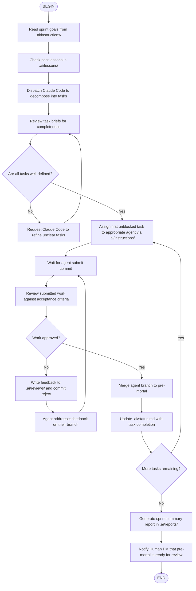

## Flow Steps Detail

### Step: Read sprint goals
- Read `.ai/instructions/` for the current sprint brief
- Identify sprint scope, priorities, and constraints

### Step: Check past lessons (before decomposition)
- Read `.ai/lessons/applied-lessons.md` for patterns already applied to this project
- If similar work was done in a past configuration, reference those patterns:
  - Check task sizing (past configs show what worked for single-session scope)
  - Check dependency patterns (past configs show what caused blocking)
  - Check acceptance criteria format (past configs show what was testable)
- Avoid patterns marked as "failed" or "anti-pattern" in `.ai/lessons/`
- Apply patterns marked as "successful" to the current decomposition
- If no lessons file exists, run `./scripts/extract-past-lessons.sh` first

### Step: Dispatch Claude Code to decompose
- Create instruction for Claude Code in `.ai/instructions/claude-decompose-sprint-X.md`
- Claude Code writes task briefs to `.ai/tasks/`

### Step: Review task briefs
- Check each task has: Status, Priority, Type, Dependencies, Acceptance Criteria
- Verify file ownership matches agent assignment
- Ensure no circular dependencies

### Step: Assign task to agent
- Pick the highest-priority unblocked task
- Write instruction to `.ai/instructions/<agent>-<task>.md`
- Commit with `[AGENT:kimi] [ACTION:delegate] [TASK:X]`

### Step: Review submitted work
- Read the task brief acceptance criteria
- Run `git diff` on the agent's branch
- Check boundary compliance
- Check for regressions
- Use the `code-review` flow for detailed review

### Step: Merge to pre-mortal
- `git merge <agent>/<task-id> --no-ff`
- Commit with `[AGENT:kimi] [ACTION:merge] [TASK:X]`

### Step: Generate sprint summary
- Count tasks completed, blocked, review cycles
- Write report to `.ai/reports/sprint-X-summary.md`
- Commit with `[AGENT:kimi] [ACTION:report] [SPRINT:X]`

