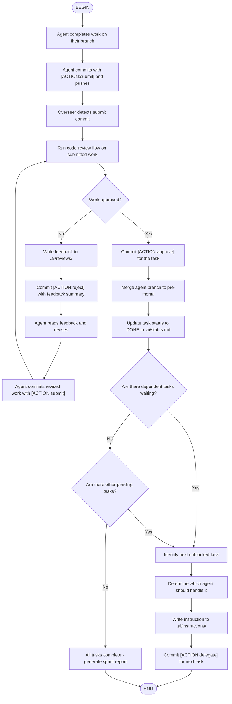

## Flow Steps Detail

### Step: Agent completes work
- Agent finishes implementation on their branch (`<agent>/<task-id>`)
- Agent runs build/tests locally to verify
- Agent reviews their own diff for boundary compliance

### Step: Agent submits
- Commit message: `[AGENT:cursor] [ACTION:submit] [TASK:TASK-P4-01] Description`
- Push branch to remote
- Optionally write completion note to `.ai/reports/`

### Step: Overseer detects submit
- Monitor for commits with `[ACTION:submit]` header
- Parse AGENT, ACTION, and TASK from commit message
- Identify which task and agent submitted

### Step: Run code-review flow
- Invoke the `code-review` flow skill on the submitted work
- This checks boundaries, acceptance criteria, regressions, and format
- Produces a verdict: APPROVE, CHANGES REQUESTED, or REJECT

### Step: Handle rejection
- Write detailed feedback to `.ai/reviews/TASK-XXX-review.md`
- Commit with `[AGENT:kimi] [ACTION:reject] [TASK:X]`
- Agent reads feedback, makes changes, and re-submits
- Loop back to code-review

### Step: Handle approval
- Commit with `[AGENT:kimi] [ACTION:approve] [TASK:X]`
- Merge agent branch to `pre-mortal`: `git merge <agent>/<task-id> --no-ff`
- Commit merge with `[AGENT:kimi] [ACTION:merge] [TASK:X]`

### Step: Update status
- Update `.ai/status.md` — move task to Recently Completed
- Update task brief status to DONE

### Step: Check dependencies
- Read all task briefs in `.ai/tasks/`
- Find tasks with `Depends on: TASK-XXX` where XXX is the just-completed task
- These tasks are now unblocked and can be assigned

### Step: Assign next task
- Pick highest-priority unblocked task
- Determine the appropriate agent based on file ownership
- Write instruction to `.ai/instructions/<agent>-<task>.md`
- Commit with `[AGENT:kimi] [ACTION:delegate] [TASK:X]`

### Step: Sprint complete
- When no tasks remain (pending, in_progress, or blocked)
- Generate sprint summary in `.ai/reports/sprint-X-summary.md`
- Notify Human PM for `pre-mortal` → `main` review

## Handoff Patterns

### Sequential Handoff (most common)
```
Cursor completes TASK-P4-01 → Review → Approve → Merge
→ Lovable picks up TASK-LOVABLE-001 (depends on P4-01) → Review → Approve → Merge
→ Sprint complete
```

### Parallel Handoff
```
Cursor works on TASK-P4-01 (no dependencies)
Lovable works on TASK-LOVABLE-001 (no dependencies)
Both submit → Both reviewed → Both merged → Next tasks assigned
```

### Rejection Loop
```
Cursor submits TASK-P4-01 → Review → REJECT (missing error handling)
→ Cursor fixes → Re-submits → Review → APPROVE → Merge
```

## Kimi Session Context in Handoffs

### Session Continuity

Each sprint has a named Kimi session. During handoffs:

- The session retains context from previous reviews and decisions
- Use `--continue` to resume the session for the next task
- Key findings are always saved to `.ai/` files (survive compaction)

### Context-Aware Handoffs

After approve/merge, the post-commit hook:

1. Runs context monitor in background (checks if compaction needed)
2. Updates session metadata with task completion
3. If all tasks DONE: triggers sprint evaluation and session archive

### Handoff with Subagent Specialization

For complex handoffs, the overseer can create specialized subagents:

- **Debugger**: When a rejection requires deep investigation
- **Performance analyzer**: When a task involves optimization
- **Documentation writer**: When handoff requires docs update

Templates: `.agents/subagents/` | Patterns: `.ai/patterns/create-subagent-*.md`

