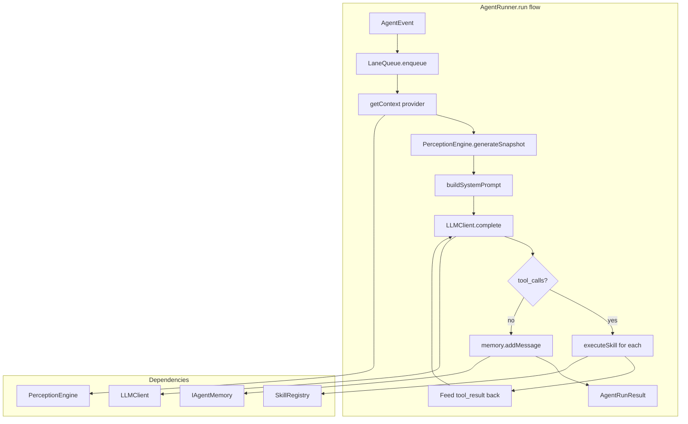

# AgentRunner Implementation Plan (TASK-008)

## Scope

Implement section 3.3 of [03-project-outline.md](.ai/idea/03-project-outline.md): the core agent loop that coordinates perception, system prompt, LLM call, tool execution, and memory. Creates three new files plus module exports.

## Architecture




## Design: Context Provider

`AgentEvent` does not contain game state (RpgEvent, map, position, nearbyPlayers). The bridge (Phase 4) will have that. AgentRunner must receive a **context provider** at construction:

```typescript
export type RunContext = {
  perceptionContext: PerceptionContext;  // for PerceptionEngine
  gameContext: GameContext;              // for SkillRegistry.executeSkill
};

export type RunContextProvider = (event: AgentEvent) => Promise<RunContext>;
```

- **AgentRunner constructor** accepts `getContext: RunContextProvider`
- **Bridge (future)**: Passes a function that queries RpgEvent, RpgWorld.getObjectsOfMap, etc.
- **Unit tests**: Pass a mock that returns static PerceptionContext and GameContext

## Implementation Order

### 1. LaneQueue ([src/agents/core/LaneQueue.ts](src/agents/core/LaneQueue.ts))

~50 lines. Map of `agentId -> Promise` chain.

- `enqueue(agentId, task)`: `const next = (current ?? Promise.resolve()).then(() => task()).catch(...)`; store and return `next`
- `isProcessing(agentId)`: Check if the stored promise is still pending (compare with a "settled" sentinel or track active count)
- `getQueueLength(agentId)`: Count pending tasks (requires a queue array per lane, not just a promise chain)

Simpler approach: Promise chain only. `isProcessing` = "is there an unsettled promise for this lane". `getQueueLength` = 0 or 1 (we only know "currently running" unless we add a queue). TASK-008 says "count pending tasks" — so we need a queue per lane.

Implementation sketch:

```typescript
private lanes = new Map<string, { promise: Promise<void>; queue: Array<() => Promise<void>> }>();

async enqueue(agentId: string, task: () => Promise<void>): Promise<void> {
  const lane = this.lanes.get(agentId) ?? { promise: Promise.resolve(), queue: [] };
  lane.queue.push(task);
  const runNext = async () => {
    const next = lane.queue.shift();
    if (next) await next().catch(err => console.error(`[LaneQueue:${agentId}]`, err)).finally(() => runNext());
  };
  lane.promise = lane.promise.then(runNext);
  this.lanes.set(agentId, lane);
  return lane.promise;
}
```

Actually the OpenClaw pattern is simpler: just chain promises. `getQueueLength` can return 0 for MVP (we only track "is processing"). Re-read the interface: "count of tasks waiting (not counting the currently executing task)". So we need a queue. Use the pattern from [docs/openclaw-patterns.md](docs/openclaw-patterns.md) lines 49-64: one chain per agent, no explicit queue length unless we add a counter.

Simpler: single promise chain per agent. `enqueue` appends to chain. `getQueueLength` = 0 for MVP (or add a counter when we push). `isProcessing` = "current promise !== resolved" — we can track by having the chain resolve a flag.

Minimal implementation: store `lastPromise` per agent. `enqueue` returns `lastPromise = lastPromise.then(task)`. `isProcessing`: we cannot easily know without a flag. Add `isProcessing = new Map<agentId, boolean>()` set true before task, false in finally. `getQueueLength`: maintain `queueLength` incremented on enqueue, decremented when task starts. Keep it simple.

### 2. LLMClient ([src/agents/core/LLMClient.ts](src/agents/core/LLMClient.ts))

Wrap `openai` SDK for Moonshot. Reuse patterns from [llm-test.ts](src/agents/core/llm-test.ts):

- API key: `process.env.MOONSHOT_API_KEY || process.env.KIMI_API_KEY`
- Base URL: `https://api.moonshot.ai/v1`
- Models: `KIMI_IDLE_MODEL` / `KIMI_CONVERSATION_MODEL` env override, else `kimi-k2-0905-chat` and `kimi-k2.5`

**Message mapping**: `LLMMessage[]` to OpenAI format. Handle:

- `role: 'user'`, `content: string` -> `{ role: 'user', content }`
- `role: 'assistant'`, `content: string` -> `{ role: 'assistant', content }`
- `content: LLMContentBlock[]` (tool_use, tool_result) -> OpenAI `content` array with `tool_calls` / `tool_call_id` structure

**Tool format**: `LLMCompletionOptions.tools` uses `ToolDefinition` in types; SkillRegistry returns `OpenAIToolDefinition`. Update `LLMCompletionOptions` to accept `ReadonlyArray<OpenAIToolDefinition>` (or a union). The skills already produce OpenAI format.

**Response parsing**: Extract `choices[0].message.content`, `choices[0].message.tool_calls`, `usage`, `finish_reason`. Map to `LLMResponse`.

**Error handling**: Classify into `context_overflow`, `rate_limit`, `timeout`, `auth_error` — wrap in try/catch, rethrow a typed error or return a result with error. Callers must catch.

### 3. Memory Stub ([src/agents/memory/InMemoryAgentMemory.ts](src/agents/memory/InMemoryAgentMemory.ts))

TASK-008 says "use a minimal stub if needed". Create a simple implementation:

- `addMessage(entry)`: Push to array, trim to `maxMessages` (default 50)
- `getRecentContext(maxTokens)`: Return messages that fit budget (4 chars/token heuristic), oldest first
- `getAllMessages()`, `getMessageCount()`
- `save(agentId)`, `load(agentId)`: No-op for stub
- `clear()`

Implements `IAgentMemory` from [memory/types.ts](src/agents/memory/types.ts).

### 4. AgentRunner ([src/agents/core/AgentRunner.ts](src/agents/core/AgentRunner.ts))

**Constructor**: `(config, perception, skills, memory, llmClient, getContext: RunContextProvider)`

**run(event)** — does NOT use LaneQueue internally. The task says "Enqueue via LaneQueue" — the **caller** (future bridge) enqueues. So AgentRunner.run() is the actual work; the bridge will do `laneQueue.enqueue(agentId, () => runner.run(event))`. AgentRunner.run is synchronous in terms of "one run" — it does the full loop.

**run(event) flow**:

1. Call `getContext(event)` to get `RunContext`
2. `perception.generateSnapshot(context.perceptionContext)`
3. `buildSystemPrompt(perception)`
4. Select model: `idle_tick` -> config.model.idle (or env), else config.model.conversation
5. Build messages: `memory.getRecentContext(2000)` -> convert to LLMMessage format; append user message from event (e.g. "A player named X approached" or "Idle tick")
6. `llmClient.complete(messages, { model, systemPrompt, tools: skills.getToolDefinitions() })`
7. If `response.toolCalls.length > 0`: execute each via `skills.executeSkill(name, input, context.gameContext)`, collect tool_result messages, append to messages, call LLM again (max 5 iterations)
8. If `response.text`: `memory.addMessage({ role: 'assistant', content: response.text })`, return `AgentRunResult`
9. Wrap in try/catch: on error, log, return `{ success: false, error: '...' }`

**buildSystemPrompt(perception)**: Assemble sections per TASK-008:

- Identity: `config.personality`
- World: `You are in {map.name}. {perception.summary}`
- Skills: `You can: ${config.skills.join(', ')}`
- Memory: `memory.getRecentContext(500)` formatted as conversation
- Rules: "Stay in character. Keep responses under 200 chars. Don't break the fourth wall."
- Current State: JSON.stringify(perception) or summary

**Event-to-user-message**: Convert event to a string for the user message: e.g. `player_action` + player name -> "A player named X is talking to you."; `idle_tick` -> "You have a moment to yourself. What do you do?"; `player_proximity` -> "A player named X has approached."

### 5. Type Updates

- **core/types.ts**: Add `RunContext` and `RunContextProvider` if not in bridge. Consider adding to a new `RunContext` type in core.
- **LLMCompletionOptions.tools**: Change to `ReadonlyArray<OpenAIToolDefinition | ToolDefinition>` or just `OpenAIToolDefinition[]` since we use Kimi.

### 6. Module Exports ([src/agents/core/index.ts](src/agents/core/index.ts))

Export: `AgentRunner`, `LaneQueue`, `LLMClient`, `InMemoryAgentMemory` (or keep in memory/), all types from types.ts.

## Files to Create


| File                                       | Purpose                                       |
| ------------------------------------------ | --------------------------------------------- |
| `src/agents/core/LaneQueue.ts`             | ILaneQueue implementation                     |
| `src/agents/core/LLMClient.ts`             | ILLMClient implementation (openai + Moonshot) |
| `src/agents/core/AgentRunner.ts`           | IAgentRunner implementation                   |
| `src/agents/memory/InMemoryAgentMemory.ts` | IAgentMemory stub                             |
| `src/agents/core/index.ts`                 | Module exports                                |


## Files to Modify

- [src/agents/core/types.ts](src/agents/core/types.ts): Add `RunContextProvider` type; optionally broaden `tools` in `LLMCompletionOptions` to accept `OpenAIToolDefinition`

## Testing Strategy

- **Unit tests**: Mock `getContext` to return static PerceptionContext and GameContext; mock `llmClient.complete` to return predefined responses. Verify tool call loop, memory updates, error handling.
- **Manual test**: Create a minimal test NPC (or extend skill-test-npc) that constructs an AgentRunner with a real `getContext` from the NPC's RpgEvent, then triggers `run` on timer or action. Requires `.env` with API key.

## Out of Scope (Do NOT)

- AgentManager (TASK-009)
- GameChannelAdapter / bridge (Phase 4)
- Complex retry/backoff
- Streaming
- moonshot AI API integration

