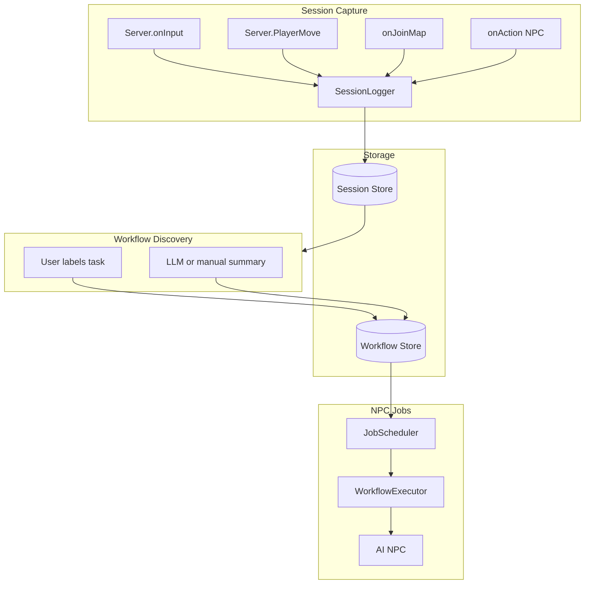

# Session Workflow and AI-NPC Jobs Feature

## Research Summary

### Current Codebase Hooks

- **Player input**: `main/player.ts` → `onInput(player, { input, moving })` — receives Direction (up/down/left/right) and Control (Action, Back). RPGJS emits `Server.onInput` for every processed input.
- **Player movement**: `Server.PlayerMove` is emitted when position changes.
- **Socket flow**: Client sends `socket.emit('move', { input: string[], frame })` → server pushes to `player.pendingMove` → `processInput` runs → `Server.onInput` fires.
- **Mobile**: Project uses `@rpgjs/mobile-gui` — mobile input is normalized to the same Control/Direction values.
- **Skills**: NPCs use `move`, `say`, `look`, `emote`, `wait` via `SkillRegistry` and `GameContext`. Move skill uses `Move.tileUp()`, etc., which can map 1:1 to player direction inputs.

### Alignment with Project Vision

From [idea/01-idea-doc.md](.ai/idea/01-idea-doc.md):

- "The game's progression system IS the agent's capability system"
- "Agents learn new skills through gameplay"
- "Dozens of AI agents live out daily routines — opening shops, patrolling, socializing"

Your idea extends this: **players demonstrate routines; NPCs learn by replaying them.**

---

## Architecture Overview




---

## Phase 1: Session Logging

### Data Model

```typescript
// Raw event — one entry per action
interface SessionEvent {
  t: number;           // timestamp (ms since session start)
  type: 'input' | 'move' | 'map_join' | 'map_leave' | 'action' | 'dialogue_choice';
  payload: Record<string, unknown>;
}

// Full session
interface PlayerSession {
  id: string;
  playerId: string;
  startedAt: string;   // ISO
  endedAt?: string;
  events: SessionEvent[];
  summary?: string;    // LLM or manual
}
```

### Capture Points


| Event           | Hook / Source                               | Payload                  |
| --------------- | ------------------------------------------- | ------------------------ |
| Input           | `RpgPlugin.on(HookServer.PlayerInput, ...)` | `{ input, moving }`      |
| Move            | `RpgPlugin.on(HookServer.PlayerMove, ...)`  | `{ position }`           |
| Map join        | `onJoinMap` in player.ts                    | `{ mapId }`              |
| Map leave       | `onLeaveMap`                                | `{ mapId }`              |
| NPC action      | `onAction` in events                        | `{ eventId, eventName }` |
| Dialogue choice | `player.showText` paths                     | Requires instrumentation |


### Implementation

- **SessionLogger** (`src/session/` or `main/session/`):  
  - `RpgPlugin.on(HookServer.PlayerInput, ...)` — append to current session buffer.  
  - `RpgPlugin.on(HookServer.PlayerMove, ...)` — append position snapshots (possibly at an interval to avoid volume).  
  - Throttle move events (e.g., every 500ms or per tile) to keep logs manageable.
- **Session lifecycle**: Start on `onConnected` (or first `onJoinMap`), end on `onDisconnected` or explicit save.
- **Storage**: `data/sessions/{playerId}/{sessionId}.json` — JSON files, one per session.

### Summary Generation

- **Option A**: Manual — player clicks "End session" and types a summary.
- **Option B**: LLM — on session end, send event list to LLM: "Summarize what the player did, choices, accomplishments."
- **Option C**: Heuristic — infer from events (e.g., map changes, NPC interactions, variables set).

---

## Phase 2: Workflow Discovery

### Workflow Model

```typescript
interface Workflow {
  id: string;
  label: string;           // e.g. "Buy potion from vendor"
  description?: string;    // Human-readable
  sessionId: string;       // Reference to source session
  taskStartIndex: number;  // Index into events where task "starts"
  taskEndIndex: number;   // Index where task "completed"
  events: SessionEvent[]; // Sliced segment
  canonicalCommands?: CanonicalCommand[]; // Normalized for NPC replay
}
```

### Task Completion Detection

- **Explicit**: Player presses a key (e.g., F5) or uses a GUI button to mark "task complete."
- **Semi-automatic**: If player interacts with a quest-giver NPC and `player.setVariable('QUEST_DONE')` is called, treat that as a completion.
- **Manual**: Player reviews session log and selects start/end indices + labels the workflow.

### Canonical Commands

Convert raw keystrokes to semantic skill-like commands for NPC replay:

- `input: Direction.Up` → `{ type: 'move', direction: 'up' }`
- `input: Control.Action` + context (facing NPC) → `{ type: 'action', targetId }`
- Group consecutive direction inputs into `move(direction, steps)` for efficiency.

This keeps workflows **replayable by the skill system** (move, say, etc.) instead of raw keystroke injection.

---

## Phase 3: NPC Jobs

### Job Model

```typescript
interface NpcJob {
  id: string;
  agentId: string;         // Which NPC
  workflowId: string;
  schedule: 'daily' | 'hourly' | 'once';
  nextRunAt: string;       // ISO
  priority?: number;
}
```

### Job Scheduler

- Timer-based (e.g., every game-day or real 24h) checks `nextRunAt` for each job.
- Pushes job into the NPC's lane queue as a special event: `{ type: 'job_tick', workflowId }`.

### Workflow Executor

- When an NPC receives `job_tick`, it fetches the workflow and executes `canonicalCommands` in sequence.
- Each command maps to an existing skill:
  - `move` → `moveSkill.execute({ direction }, context)`
  - `action` → Trigger interaction with target (e.g., `event.triggerCollision` or equivalent)
- Handle failures: if move is blocked, skip or retry according to policy.

### Integration with Existing Agent System

- Jobs run **in addition to** idle behavior and player interactions.
- While executing a job, the agent could:
  - **Option A**: Pause idle LLM calls and just run the workflow ( deterministic, low-cost).
  - **Option B**: Use LLM only for high-level decisions ("go to work") and then execute the workflow (hybrid).

---

## File Locations (Cursor-Owned)


| Component               | Path                                               |
| ----------------------- | -------------------------------------------------- |
| SessionLogger           | `src/session/SessionLogger.ts`                     |
| Session types           | `src/session/types.ts`                             |
| WorkflowStore           | `src/session/WorkflowStore.ts`                     |
| JobScheduler            | `src/agents/jobs/JobScheduler.ts`                  |
| WorkflowExecutor        | `src/agents/jobs/WorkflowExecutor.ts`              |
| Player hook wiring      | `main/player.ts` (SessionLogger init)              |
| RpgPlugin subscriptions | `main/server.ts` or a new `main/session-plugin.ts` |


---

## Key Design Decisions

1. **Throttling**: Log move events at tile granularity or by time interval — avoid logging every frame.
2. **Privacy**: Session logging should be opt-in and disclosed (e.g., "Session recording" toggle).
3. **Abstraction level**: Prefer canonical commands over raw keystrokes for NPC replay — more robust to map changes and timing.
4. **Mobile parity**: Mobile GUI already emits same input types — no extra capture needed beyond existing hooks.
5. **Storage**: JSON files under `data/` initially; consider SQLite or DB later if workflows grow.

---

## Open Questions

1. **Task completion**: Prefer explicit (player button), semi-automatic (quest variables), or manual (retroactive labeling)?
2. **Summary**: Manual, LLM-generated, or heuristic?
3. **Job timing**: Real-time (e.g., 9am game time) vs. elapsed (e.g., every 30 min real time)?
4. **Scope**: MVP = session log + manual workflow save, or full pipeline including jobs?

