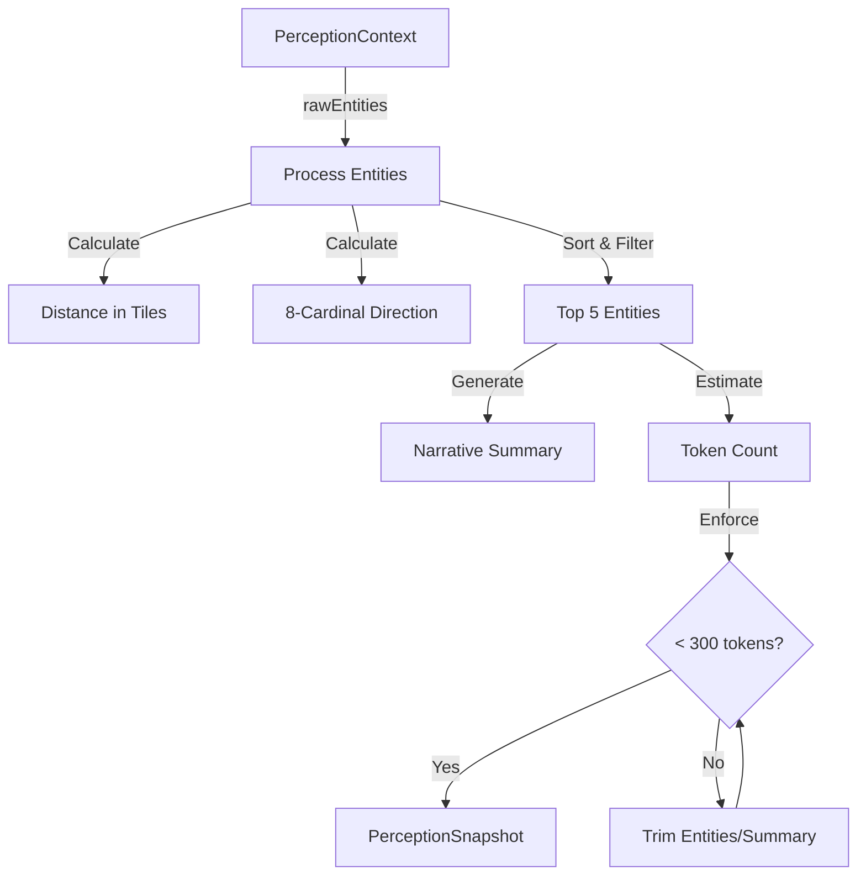

# TASK-006: Build PerceptionEngine Implementation Plan

## Objective

Create a stateless `PerceptionEngine` class that implements `IPerceptionEngine` and converts game state into compact `PerceptionSnapshot` objects that fit within a strict 300-token budget.

## Files to Create

- `src/agents/perception/PerceptionEngine.ts` (~200 lines)
- `src/agents/perception/index.ts` (exports)

## Implementation Architecture




## Step-by-Step Implementation

### Step 1: Create File Structure and Imports

**File**: `src/agents/perception/PerceptionEngine.ts`

```typescript
import { Vector2d } from '@rpgjs/common'
import type {
  IPerceptionEngine,
  PerceptionContext,
  PerceptionSnapshot,
  PerceptionLocation,
  NearbyEntity,
  PERCEPTION_TOKEN_BUDGET,
  MAX_NEARBY_ENTITIES,
} from './types'
import type { Position } from '../bridge/types'
```

### Step 2: Implement Distance Calculation

**Function**: `calculateDistanceInTiles(npcPos: Position, targetPos: Position, tileSize: number): number`

- Convert positions to `Vector2d` instances
- Use `Vector2d.distanceWith()` to get pixel distance
- Divide by `tileSize` (typically 32) to get tile distance
- Return rounded value

**Implementation**:

```typescript
function calculateDistanceInTiles(
  npcPos: Position,
  targetPos: Position,
  tileSize: number = 32
): number {
  const npcVec = new Vector2d(npcPos.x, npcPos.y, npcPos.z || 0)
  const targetVec = new Vector2d(targetPos.x, targetPos.y, targetPos.z || 0)
  const pixelDistance = npcVec.distanceWith(targetVec)
  return Math.round(pixelDistance / tileSize)
}
```

**Note**: `tileSize` defaults to 32 (standard RPGJS tile size). The bridge layer should provide actual tile size if available, but 32 is a safe default.

### Step 3: Implement Direction Calculation

**Function**: `calculateDirection(npcPos: Position, targetPos: Position): string`

- Calculate angle using `Math.atan2(dy, dx)`
- Map angle to 8 cardinal directions
- Return direction string

**Direction Mapping**:

- N: -90° to -67.5° and 67.5° to 90°
- NE: -67.5° to -22.5°
- E: -22.5° to 22.5°
- SE: 22.5° to 67.5°
- S: 67.5° to 112.5° and -112.5° to -67.5°
- SW: 112.5° to 157.5°
- W: 157.5° to 180° and -180° to -157.5°
- NW: -157.5° to -112.5°

**Implementation**:

```typescript
function calculateDirection(npcPos: Position, targetPos: Position): string {
  const dx = targetPos.x - npcPos.x
  const dy = targetPos.y - npcPos.y
  const angle = Math.atan2(dy, dx) * (180 / Math.PI)
  
  // Normalize to 0-360 range
  const normalizedAngle = angle < 0 ? angle + 360 : angle
  
  // Map to 8 cardinals
  if (normalizedAngle >= 337.5 || normalizedAngle < 22.5) return 'east'
  if (normalizedAngle >= 22.5 && normalizedAngle < 67.5) return 'southeast'
  if (normalizedAngle >= 67.5 && normalizedAngle < 112.5) return 'south'
  if (normalizedAngle >= 112.5 && normalizedAngle < 157.5) return 'southwest'
  if (normalizedAngle >= 157.5 && normalizedAngle < 202.5) return 'west'
  if (normalizedAngle >= 202.5 && normalizedAngle < 247.5) return 'northwest'
  if (normalizedAngle >= 247.5 && normalizedAngle < 292.5) return 'north'
  return 'northeast' // 292.5 to 337.5
}
```

### Step 4: Process and Enrich Entities

**Function**: `processEntities(context: PerceptionContext, tileSize: number): NearbyEntity[]`

- For each entity in `context.rawEntities`:
- Calculate distance using `calculateDistanceInTiles()`
- Calculate direction using `calculateDirection()`
- Create enriched `NearbyEntity` with distance and direction
- Sort by distance (closest first)
- Cap at `MAX_NEARBY_ENTITIES` (5)

**Implementation**:

```typescript
function processEntities(
  context: PerceptionContext,
  tileSize: number = 32
): NearbyEntity[] {
  const npcPos = context.position
  
  const enriched = context.rawEntities.map(entity => ({
    ...entity,
    distance: calculateDistanceInTiles(npcPos, entity.position, tileSize),
    direction: calculateDirection(npcPos, entity.position),
  }))
  
  // Sort by distance (closest first)
  enriched.sort((a, b) => a.distance - b.distance)
  
  // Cap at MAX_NEARBY_ENTITIES
  return enriched.slice(0, MAX_NEARBY_ENTITIES)
}
```

### Step 5: Generate Narrative Summary

**Function**: `generateSummary(entities: NearbyEntity[], mapName: string): string`

- Format: `"You are in {mapName}. {nearbyDescription}."`
- Build nearby description from entities:
- If no entities: "It is quiet."
- If 1 entity: "A {type} named {name} is {direction} of you."
- If 2+ entities: "A {type} named {name} approaches from the {direction}. {count} other entities are nearby."
- Keep to 1-2 sentences, second person perspective

**Implementation**:

```typescript
function generateSummary(entities: NearbyEntity[], mapName: string): string {
  if (entities.length === 0) {
    return `You are in ${mapName}. It is quiet.`
  }
  
  const first = entities[0]
  const restCount = entities.length - 1
  
  let description = `A ${first.type} named ${first.name} is ${first.direction} of you`
  
  if (restCount > 0) {
    description += `. ${restCount} other ${restCount === 1 ? 'entity' : 'entities'} ${restCount === 1 ? 'is' : 'are'} nearby`
  }
  
  return `You are in ${mapName}. ${description}.`
}
```

### Step 6: Estimate Token Count

**Function**: `estimateTokens(snapshot: Omit<PerceptionSnapshot, 'tokenEstimate'>): number`

- Heuristic: `1 token ≈ 4 characters`
- Count: `summary.length + JSON.stringify(entities).length + JSON.stringify(location).length`
- Return total token estimate

**Implementation**:

```typescript
function estimateTokens(
  summary: string,
  entities: NearbyEntity[],
  location: PerceptionLocation
): number {
  const summaryTokens = summary.length / 4
  const entitiesTokens = JSON.stringify(entities).length / 4
  const locationTokens = JSON.stringify(location).length / 4
  return Math.ceil(summaryTokens + entitiesTokens + locationTokens)
}
```

### Step 7: Enforce Token Budget

**Function**: `enforceTokenBudget(snapshot: PerceptionSnapshot): PerceptionSnapshot`

- If `tokenEstimate <= PERCEPTION_TOKEN_BUDGET`, return as-is
- If over budget:

1. Trim entities from farthest (remove last entity, recalculate)
2. If still over, truncate summary to fit
3. Recalculate token estimate

- Return adjusted snapshot

**Implementation**:

```typescript
function enforceTokenBudget(snapshot: PerceptionSnapshot): PerceptionSnapshot {
  if (snapshot.tokenEstimate <= PERCEPTION_TOKEN_BUDGET) {
    return snapshot
  }
  
  let entities = [...snapshot.entities]
  let summary = snapshot.summary
  
  // Trim entities from farthest
  while (entities.length > 0) {
    const testSnapshot = {
      ...snapshot,
      entities: entities,
      summary,
    }
    const tokens = estimateTokens(summary, entities, snapshot.location)
    
    if (tokens <= PERCEPTION_TOKEN_BUDGET) {
      return {
        ...testSnapshot,
        tokenEstimate: tokens,
      }
    }
    
    entities.pop() // Remove farthest entity
  }
  
  // If still over budget, truncate summary
  const maxSummaryLength = PERCEPTION_TOKEN_BUDGET * 4 // 4 chars per token
  const truncatedSummary = summary.slice(0, maxSummaryLength - 3) + '...'
  
  const finalTokens = estimateTokens(truncatedSummary, [], snapshot.location)
  
  return {
    ...snapshot,
    entities: [],
    summary: truncatedSummary,
    tokenEstimate: finalTokens,
  }
}
```

### Step 8: Implement Main Class

**Class**: `PerceptionEngine implements IPerceptionEngine`**Constructor**: No parameters (stateless)**Method**: `async generateSnapshot(context: PerceptionContext): Promise<PerceptionSnapshot>`**Flow**:

1. Process entities (calculate distance/direction, sort, cap)
2. Generate summary
3. Build location object
4. Create initial snapshot
5. Estimate tokens
6. Enforce token budget
7. Return final snapshot

**Implementation**:

```typescript
export class PerceptionEngine implements IPerceptionEngine {
  private readonly defaultTileSize = 32 // Standard RPGJS tile size
  
  async generateSnapshot(context: PerceptionContext): Promise<PerceptionSnapshot> {
    // Step 1: Process entities
    const entities = processEntities(context, this.defaultTileSize)
    
    // Step 2: Generate summary
    const mapName = context.map.name || context.map.id
    const summary = generateSummary(entities, mapName)
    
    // Step 3: Build location
    const location: PerceptionLocation = {
      map: context.map,
      position: context.position,
    }
    
    // Step 4: Create initial snapshot
    const initialSnapshot: Omit<PerceptionSnapshot, 'tokenEstimate'> = {
      summary,
      entities,
      location,
      timestamp: Date.now(),
    }
    
    // Step 5: Estimate tokens
    const tokenEstimate = estimateTokens(
      summary,
      entities,
      location
    )
    
    // Step 6: Enforce token budget
    const snapshot: PerceptionSnapshot = {
      ...initialSnapshot,
      tokenEstimate,
    }
    
    return enforceTokenBudget(snapshot)
  }
}
```

### Step 9: Create Index Exports

**File**: `src/agents/perception/index.ts`

```typescript
export { PerceptionEngine } from './PerceptionEngine'
export type {
  IPerceptionEngine,
  PerceptionContext,
  PerceptionSnapshot,
  PerceptionLocation,
  NearbyEntity,
  EntityType,
} from './types'
export { PERCEPTION_TOKEN_BUDGET, MAX_NEARBY_ENTITIES } from './types'
```

## Edge Cases to Handle

1. **Empty entities list**: Summary should say "It is quiet."
2. **Over token budget**: Trim entities first, then truncate summary
3. **Zero distance entities**: Handle gracefully (same tile)
4. **Missing map name**: Fall back to map ID
5. **Invalid positions**: Validate before calculation

## Testing Strategy

**Unit Tests** (create `src/agents/perception/PerceptionEngine.test.ts`):

- Test distance calculation with known positions
- Test all 8 cardinal directions
- Test entity sorting (closest first)
- Test entity capping (max 5)
- Test token budget enforcement
- Test empty entities scenario
- Test over-budget trimming

**Test Cases**:

```typescript
// Distance calculation
expect(calculateDistanceInTiles({x: 0, y: 0}, {x: 32, y: 0}, 32)).toBe(1)
expect(calculateDistanceInTiles({x: 0, y: 0}, {x: 64, y: 64}, 32)).toBeCloseTo(2.83, 1)

// Direction calculation
expect(calculateDirection({x: 0, y: 0}, {x: 32, y: 0})).toBe('east')
expect(calculateDirection({x: 0, y: 0}, {x: 0, y: -32})).toBe('north')
expect(calculateDirection({x: 0, y: 0}, {x: 32, y: -32})).toBe('northeast')

// Token budget
const snapshot = await engine.generateSnapshot(context)
expect(snapshot.tokenEstimate).toBeLessThanOrEqual(300)
```

## Dependencies

- `@rpgjs/common` - For `Vector2d` class
- `src/agents/perception/types.ts` - All type definitions
- `src/agents/bridge/types.ts` - `Position` and `MapInfo` types

## Acceptance Criteria

- `PerceptionEngine` class implements `IPerceptionEngine`
- `generateSnapshot()` returns valid `PerceptionSnapshot`
- Distance calculated correctly (pixel → tile conversion)
- All 8 cardinal directions calculated correctly
- Entities sorted by distance (closest first)
- Entities capped at 5 (`MAX_NEARBY_ENTITIES`)
- Token budget enforced (< 300 tokens)
- Summary generated in second person
- Empty entity list handled gracefully
- `rpgjs build` passes
- `npx tsc --noEmit` passes

## Implementation Notes

1. **Tile Size**: Default to 32 pixels per tile. The bridge layer (future work) can pass actual tile size if available.
2. **Stateless Design**: `PerceptionEngine` is stateless - no instance variables. Each call generates a fresh snapshot.
3. **Async Method**: `generateSnapshot()` is async to match interface, but implementation is synchronous. This allows future async operations (e.g., vector search) without breaking the interface.
4. **Token Estimation**: Simple heuristic (4 chars = 1 token) is sufficient for MVP. More accurate tokenization can be added later if needed.
5. **Error Handling**: All calculations should handle edge cases (zero distance, invalid positions) gracefully without throwing.

## References

