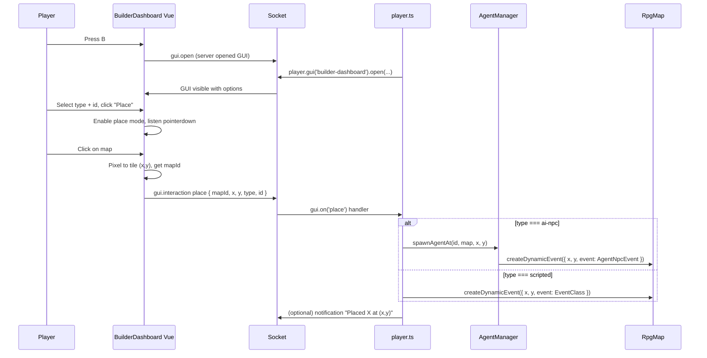

# In-Game Builder Dashboard — Implementation Plan

## Goal

Branch: **cursor/builder-dashboard**. Implement a minimal "builder mode" so you can open a dashboard in-game (e.g. press **B**), choose **AI NPC** or **Scripted NPC**, pick which one (e.g. elder-theron, test-agent, Test NPC, Guard), then **click on the map** to place it. Placement is handled on the server via `map.createDynamicEvent` and a new `AgentManager.spawnAgentAt` for AI NPCs.

## Architecture

## 1. Branch and scope

- Create branch **cursor/builder-dashboard** from current main.
- No changes to TASK or status files; this is an exploratory feature on a branch.

## 2. Server: open dashboard and handle "place"

**File: [main/player.ts**](main/player.ts)

- **Open dashboard**: In `onInput`, when `input === 'b'` (or a dedicated key): get `player.gui('builder-dashboard')`, register `gui.on('place', async (data) => { ... })`, then `gui.open({ mapId: player.getCurrentMap()?.id, aiNpcConfigs: ['elder-theron', 'test-agent'], scriptedEvents: [{ id: 'test-npc', name: 'Test NPC' }, { id: 'guard', name: 'Guard' }] })` so the client has options. Use `blockPlayerInput: true` so the player doesn't move while the dashboard is open.
- **Place handler**: `const map = player.getCurrentMap(); if (!map || map.id !== data.mapId) return;` If `data.type === 'ai-npc'`: call `await agentManager.spawnAgentAt(data.id, map, data.x, data.y, data.visibility, data.visibility === 'only-me' ? player : undefined)` (pass player for Scenario spawn). Else if `data.type === 'scripted'`: use a small registry mapping `data.id` to event classes, then call `map.createDynamicEvent({ x, y, event })` (visibility === 'everyone') or `player.createDynamicEvent({ x, y, event })` (visibility === 'only-me'). On success, optionally `player.showNotification('Placed ...')`.
- **Visibility toggle**: Dashboard sends `visibility: 'everyone' | 'only-me'`. Server uses **Shared** = `map.createDynamicEvent(...)` (everyone sees it) or **Scenario** = `player.createDynamicEvent(...)` (only this player sees it). See `docs/rpgjs-reference/docs/guide/create-event.md` Example 3 (Scenario mode).
- **Registry**: Define at top of player.ts something like `const SCRIPTED_EVENT_REGISTRY: Record<string, new (...args: any[]) => RpgEvent> = { 'test-npc': TestNpcEvent, 'guard': GuardEvent }` so the place handler can look up the class.

## 3. AgentManager: spawn one AI NPC at custom (x, y)

**File: [src/agents/core/AgentManager.ts**](src/agents/core/AgentManager.ts)

- Add **spawnAgentAt(configId: string, map: RpgMap, x: number, y: number, visibility?: 'everyone' | 'only-me'): Promise\<boolean\>** (player required for 'only-me' — pass from caller).
  - If configs not loaded, `await this.loadConfigs('src/config/agents')`.
  - `const instance = this.agents.get(configId)`; if !instance return false.
  - `setSpawnContext({ config: instance.config, instance })`.
  - If `visibility === 'only-me'` and `player` is provided: `player.createDynamicEvent({ x, y, event: AgentNpcEventClass })` (Scenario mode). Else: `map.createDynamicEvent({ x, y, event: AgentNpcEventClass })` (Shared).
  - Log and return true.
- Do not add the map to `spawnedMaps` (so normal spawn-on-join is unchanged); this is an extra, one-off placement.

## 4. Client: Builder Dashboard Vue GUI

**New file: main/gui/builder-dashboard.vue**

- **Name**: `BuilderDashboard` so the GUI id is `builder-dashboard` (kebab-case).
- **Inject**: `rpgEngine`, `rpgGui`, `rpgGuiInteraction`, `rpgScene` (and `rpgGuiClose` if we want explicit close).
- **Props from server** (passed in `gui.open(...)`): `mapId`, `aiNpcConfigs` (array of strings), `scriptedEvents` (array of `{ id, name }`).
- **UI**:
  - Title: "Builder — Place on map"
  - **Visibility**: Toggle or select **"Only me"** (Scenario) vs **"Everyone"** (Shared). Send as `visibility: 'only-me' | 'everyone'` in the place payload.
  - Category: buttons or select for **AI NPC** | **Scripted NPC**.
  - Sub-list: if AI NPC show `aiNpcConfigs`, if Scripted show `scriptedEvents` (display name, value id).
  - Button: **"Click map to place"** — toggles `placeMode = true` and optionally disables the rest of the panel so the next click is on the map.
  - Button: **Close** (or listen Escape) — call `rpgGuiClose('builder-dashboard')` or equivalent to close.
- **Place mode**:
  - When `placeMode` is true, in `mounted` (or a watcher) get the scene: `const scene = this.rpgScene()`. If scene and scene.viewport, register `scene.on('pointerdown', (position) => { ... })`. Convert pixel `position` to tile: e.g. `tileX = Math.floor(position.x / scene.tileWidth)`, `tileY = Math.floor(position.y / scene.tileHeight)` (use scene's tile dimensions; fallback 32 if missing). Then `this.rpgGuiInteraction('builder-dashboard', 'place', { mapId: this.mapId, x: tileX, y: tileY, type: this.selectedType, id: this.selectedId })`. Set `placeMode = false` and remove the pointer listener (if the API allows) so the next click doesn't place again.
- **Styling**: Simple panel (e.g. fixed position, semi-transparent background, list of options). Match existing default-gui style roughly so it feels in-game.

## 5. Key binding

- RPGJS typically maps keyboard to input names. Use an existing key that isn't used for movement/action (e.g. **Back** opens main menu). For **B** we may need to check how input is mapped in the project (e.g. in client or a config). If **B** isn't wired, use an alternative (e.g. **Escape** to open builder from a "Builder" menu item, or a key that already exists). Prefer: add **B** for builder in [main/player.ts](main/player.ts) in `onInput` by checking `input === 'b'` (if the engine sends that). If the engine doesn't expose **B**, document "press the key that sends action X" or add a minimal client-side key listener that asks the server to open the GUI via a custom socket event; the plan prefers reusing `onInput` with a known key.

## 6. Files to add or touch

| Action        | Path                                                                                 |
| ------------- | ------------------------------------------------------------------------------------ |
| Create branch | cursor/builder-dashboard                                                             |
| Create        | main/gui/builder-dashboard.vue                                                       |
| Modify        | main/player.ts (onInput open builder, gui.on('place', ...), SCRIPTED_EVENT_REGISTRY) |
| Modify        | src/agents/core/AgentManager.ts (spawnAgentAt)                                       |

## 7. Verification

- Run `rpgjs build` and fix any errors.
- In-game: press the chosen key (e.g. B), dashboard opens; select AI NPC -> elder-theron, click "Click map to place", then click on the map; elder-theron appears at that tile. Repeat for scripted (e.g. Guard). No persistence of builder placements in this iteration (restart clears dynamic placements).

## 8. Out of scope for this branch

- **Persistence of placed events** (save/load). Follow-up: persist placements as JSON (e.g. keyed by map id or player) and re-apply on map load via `map.createDynamicEvent` / `player.createDynamicEvent`; see `docs/rpgjs-reference/docs/guide/save.md` and `docs/rpgjs-reference/docs/guide/synchronization.md`.
- Deleting or moving placed events (use `map.removeEvent(eventId)` / list `map.events` when added).
- "Object" or "API" types (only AI NPC + Scripted NPC).
- Builder-placed **shapes** (optional later): `map.createShape({ x, y, width, height, properties })` per `docs/rpgjs-reference/docs/guide/create-shape.md`.
- Labeling UI (e.g. list of placed things with type labels) — can be a follow-up.

## 9. RPGJS features used (reference for later work)

| Feature | Use in builder | Guide / API |
|--------|-----------------|-------------|
| **EventMode.Shared** | Place for everyone: `map.createDynamicEvent(...)` | create-event.md |
| **EventMode.Scenario** | Place only for me: `player.createDynamicEvent(...)` | create-event.md Example 3 |
| **player.save() / load(json)** | Persist builder state or placements (same pattern as player progress) | save.md, synchronization.md |
| **setVariable / getVariable** | Builder flags or placement metadata (saved with player) | create-event.md |
| **player.gui(id).open() / .on()** | Dashboard open and handle place/remove | commands/gui.md, GuiManager |
| **map.events / map.removeEvent** | List and delete placed events | Map API (EventManager) |
| **Input binding** | Key to open builder (e.g. B) | inputs.md, rpg.toml |
| **map.createShape** | Optional: builder-placed zones/triggers | create-shape.md |

## References

- **Guides**: `docs/rpgjs-reference/docs/guide/create-event.md` (Shared vs Scenario), `create-shape.md`, `synchronization.md`, `save.md`, `inputs.md`; `docs/commands/common.md`, `gui.md`; `docs/classes/event.md`, `map.md`, `player.md`.
- GUI interaction: server [Player.ts](docs/rpgjs-reference/packages/server/src/Player/Player.ts) `_socket.on('gui.interaction', ...)` and [GuiManager](docs/rpgjs-reference/packages/server/src/Player/GuiManager.ts) `gui(guiId)`, `gui.open(...)`, `gui.on(...)`.
- Client: [default-gui shop](docs/rpgjs-reference/packages/plugins/default-gui/src/shop/main.vue) uses `rpgSocket().emit('gui.interaction', { guiId, name, data })`.
- Scene pointer: [Map.ts](docs/rpgjs-reference/packages/client/src/Scene/Map.ts) `on('pointerdown', (position) => ...)`; position in pixels; scene has `tileWidth`, `tileHeight`.
- Spawn: [AgentManager.spawnAgentsOnMap](src/agents/core/AgentManager.ts) and [player.ts](main/player.ts) `map.createDynamicEvent`.
