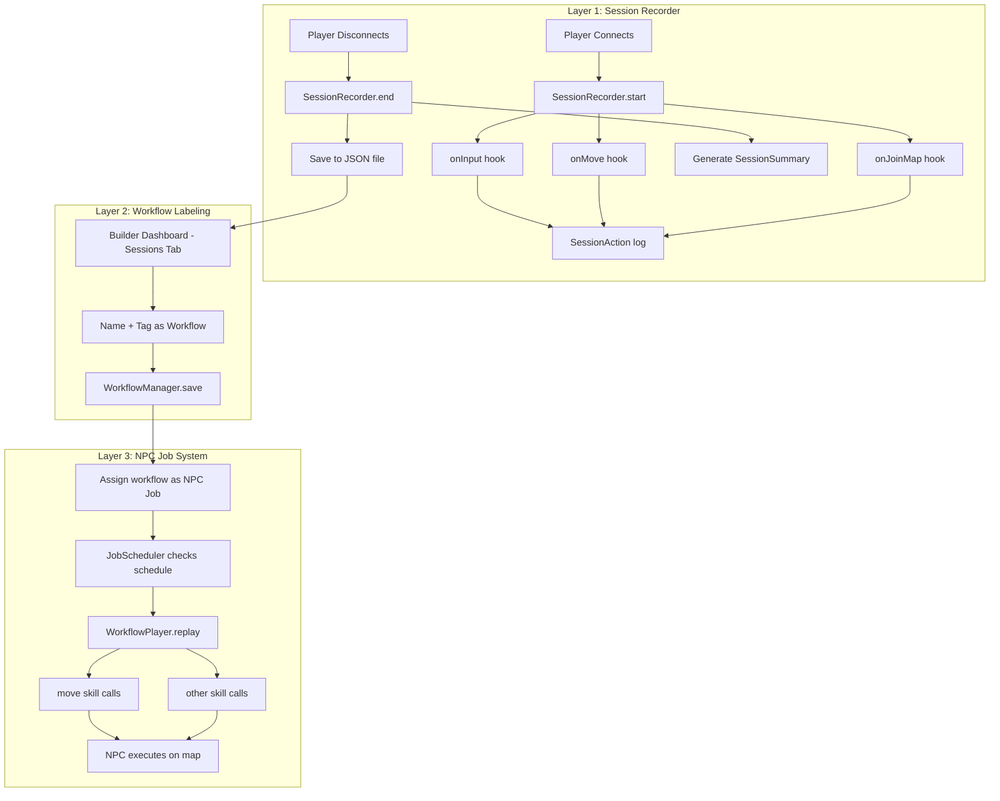

# Session Recorder, Workflow Discovery, and NPC Job System

## Concept

This feature has three layers:

1. **Session Recorder** -- captures everything a player does during a session (inputs, movements, interactions, map changes) as a structured log
2. **Workflow Labeling** -- lets a player (or admin) mark a session recording as a named "workflow" that accomplishes a specific task
3. **NPC Job System** -- assigns workflows to AI NPCs as repeatable daily "jobs" they execute by replaying the recorded action sequence

This aligns beautifully with the project's core vision in [01-idea-doc.md](.ai/idea/01-idea-doc.md): the "Command-as-Knowledge" model where agents learn new capabilities through gameplay. Here, a *human player* demonstrates the capability, and the NPC learns it by replaying the recording.

---

## Layer 1: Session Recorder

### What gets captured

Every player session (connect to disconnect) is recorded as a `SessionRecording`:

```typescript
interface SessionRecording {
  id: string;               // unique recording ID
  playerId: string;         // RPGJS player ID
  playerName: string;       // display name
  startedAt: number;        // Date.now() timestamp
  endedAt?: number;         // set on disconnect
  startMap: string;         // map ID at session start

  // The raw action log -- every input, movement, and event
  actions: SessionAction[];

  // Auto-generated summary (built on disconnect)
  summary?: SessionSummary;
}

interface SessionAction {
  timestamp: number;        // ms since session start (relative)
  type: 'input' | 'move' | 'map_change' | 'npc_interaction' | 'item' | 'custom';
  data: {
    input?: string;         // 'up' | 'down' | 'left' | 'right' | 'action' | 'back' | custom
    position?: { x: number; y: number };
    mapId?: string;
    npcId?: string;
    npcName?: string;
    detail?: string;        // human-readable description
  };
}

interface SessionSummary {
  duration: number;         // total session time in ms
  mapsVisited: string[];    // unique map IDs
  npcsInteracted: string[]; // NPC names talked to
  totalMoves: number;       // movement count
  totalActions: number;     // action key presses
  narrative: string;        // auto-generated text summary
}
```

### RPGJS hooks used

All recording hooks go in a new module or extend [main/player.ts](main/player.ts):


| Hook             | What it records                                                                             |
| ---------------- | ------------------------------------------------------------------------------------------- |
| `onConnected`    | Creates new `SessionRecording`, starts the log                                              |
| `onInput`        | Every keypress: direction, action, back, custom keys (already receives `{ input, moving }`) |
| `onMove`         | Position changes (sampled -- not every pixel, but tile transitions)                         |
| `onJoinMap`      | Map transitions                                                                             |
| `onDisconnected` | Ends recording, generates summary                                                           |


**Important**: `onMove` fires on every position change at ~60 FPS. We must **sample** it -- only record when the tile position changes (divide pixel position by tile size, compare to last recorded tile).

### Storage

- **MVP**: In-memory `Map<string, SessionRecording>` with JSON file persistence (one file per session in `data/sessions/`)
- **Post-MVP**: Supabase table (the project already has [Supabase integration](src/config/supabase.ts) for agent memory)

### New files


| File                              | Purpose                                                                           |
| --------------------------------- | --------------------------------------------------------------------------------- |
| `src/sessions/types.ts`           | `SessionRecording`, `SessionAction`, `SessionSummary` interfaces                  |
| `src/sessions/SessionRecorder.ts` | Class: manages active recordings, provides `record()` method, generates summaries |
| `src/sessions/storage.ts`         | JSON file persistence (save/load recordings)                                      |
| `src/sessions/index.ts`           | Singleton + factory                                                               |


---

## Layer 2: Workflow Labeling

A **Workflow** is a curated session recording that has been labeled as accomplishing a specific task.

```typescript
interface Workflow {
  id: string;                // unique workflow ID
  name: string;              // human-readable label (e.g. "Harvest herbs from north garden")
  description?: string;      // what this workflow accomplishes
  sourceRecordingId: string; // which session recording it came from
  
  // The cleaned-up action sequence (may trim idle time, remove mistakes)
  actions: SessionAction[];
  
  // Metadata
  createdAt: number;
  createdBy: string;         // player who recorded it
  tags: string[];            // e.g. ['gathering', 'herbs', 'north-garden']
  estimatedDuration: number; // how long the replay takes in ms
  
  // Requirements for an NPC to execute this
  requiredSkills: string[];  // e.g. ['move'] -- skills the NPC needs
  startMap: string;          // which map the workflow begins on
  startPosition: { x: number; y: number }; // approximate start tile
}
```

### How workflows are created

**Option A (MVP)**: Builder Dashboard integration. After a session ends, the player presses B to open the builder dashboard, which now has a "Sessions" tab showing recent recordings. The player can select one, give it a name and tags, and save it as a workflow.

**Option B (stretch)**: In-game "Logbook" item. Player opens a quest-log-style GUI that shows their session history and allows labeling.

### Workflow discovery

The system can also detect "interesting" sessions automatically:

- Sessions that visit multiple maps (exploration workflow)
- Sessions with specific NPC interactions (quest completion)
- Sessions that end at a different map than they started (delivery route)
- Sessions flagged by the player pressing a "mark" key during play

### New files


| File                               | Purpose                                    |
| ---------------------------------- | ------------------------------------------ |
| `src/sessions/Workflow.ts`         | Workflow interface + WorkflowManager class |
| `src/sessions/workflow-storage.ts` | JSON file persistence for workflows        |


---

## Layer 3: NPC Job System

This is where the magic happens. Workflows become "jobs" that NPCs execute on a schedule.

```typescript
interface NpcJob {
  id: string;
  workflowId: string;       // which workflow to replay
  assignedTo: string;       // agent config ID (e.g. 'elder-theron')
  schedule: JobSchedule;
  status: 'pending' | 'active' | 'completed' | 'failed';
  lastRun?: number;
  nextRun?: number;
}

interface JobSchedule {
  type: 'daily' | 'interval' | 'once';
  // For 'daily': what "game hour" to start (if day-night cycle exists)
  // For 'interval': how many ms between runs
  // For 'once': run on next tick
  startHour?: number;       // 0-23 game hours
  intervalMs?: number;      // for 'interval' type
}
```

### How NPC job replay works

A new skill called `execute_workflow` (or the job system injects actions directly):

1. **JobScheduler** (new class) runs on a timer, checks which NPCs have pending jobs
2. When a job triggers, the scheduler pauses the NPC's normal idle tick
3. The scheduler replays the workflow's `SessionAction[]` sequence:
  - For `input` actions with directions: call the existing `move` skill
  - For `input` actions with 'action': trigger the NPC's `onAction` equivalent
  - For `map_change`: (stretch) teleport or path-find to the target map
  - Timing between actions is preserved from the recording (with optional speed multiplier)
4. When the replay completes, the NPC resumes normal idle behavior
5. The result is logged (success/failure/partial)

### Integration with existing agent system

The job system integrates cleanly with the existing architecture:

- **LaneQueue**: Job actions enter the same per-NPC serial queue, preventing conflicts with conversation
- **AgentRunner**: During a job, idle ticks are suppressed. If a player talks to the NPC mid-job, the NPC can say "I'm busy working right now" (personality-aware response)
- **Bridge**: The `GameChannelAdapter` gets a new `isExecutingJob` state that modifies behavior
- **Agent Config (YAML)**: Jobs can be assigned in the YAML config:

```yaml
# src/config/agents/elder-theron.yaml
id: elder-theron
name: Elder Theron
# ... existing config ...
jobs:
  - workflow: morning-patrol
    schedule: { type: daily, startHour: 6 }
  - workflow: evening-gathering
    schedule: { type: daily, startHour: 18 }
```

### New files


| File                             | Purpose                                             |
| -------------------------------- | --------------------------------------------------- |
| `src/sessions/JobScheduler.ts`   | Manages NPC job assignments and triggers            |
| `src/sessions/WorkflowPlayer.ts` | Replays a workflow's action sequence through an NPC |
| `src/sessions/job-types.ts`      | `NpcJob`, `JobSchedule` interfaces                  |


---

## Architecture Flow




---

## Implementation Phases

### Phase 1: Session Recording (MVP)

Build the recording infrastructure. This is standalone and immediately useful for debugging and analytics.

- `SessionRecorder` class with `start()`, `recordAction()`, `end()`
- Hook into `onConnected`, `onInput`, `onMove` (tile-sampled), `onJoinMap`, `onDisconnected` in [main/player.ts](main/player.ts)
- JSON file persistence in `data/sessions/`
- Console logging with `[SessionRecorder]` prefix
- Auto-generate `SessionSummary` on disconnect

### Phase 2: Workflow Labeling

Add the ability to save and manage workflows.

- `WorkflowManager` class
- Extend the builder dashboard GUI (already exists in [main/gui/](main/gui/)) with a "Sessions" tab
- Allow naming, tagging, and saving recordings as workflows
- JSON file persistence in `data/workflows/`

### Phase 3: NPC Job Replay

The payoff: NPCs going to work.

- `WorkflowPlayer` class that replays action sequences through an NPC event
- `JobScheduler` class that manages job timing
- Integration with `GameChannelAdapter` (pause idle ticks during jobs)
- YAML config extension for job assignments
- NPC awareness: "I'm working" responses during job execution

### Phase 4: Polish (stretch)

- LLM-powered session summary generation (send action log to LLM for narrative summary)
- Workflow validation (check if start position/map still exists)
- Workflow editor (trim, adjust timing, remove mistakes from a recording)
- NPC path-finding for cross-map workflows
- Job success/failure tracking with retry logic
- Day-night cycle integration for "daily" schedules

---

## Key Design Decisions

1. **Tile-sampled movement, not pixel**: Record tile transitions only. At 32px tiles, this reduces move events from ~60/sec to ~2-4/sec max.
2. **Relative timestamps**: Actions use `ms since session start`, not absolute time. This makes replays speed-adjustable.
3. **Skill-based replay, not raw input injection**: Instead of injecting raw keypresses into the NPC, translate recorded inputs into existing skill calls (`move`, `say`, etc.). This means the replay respects collision, blocking, and game rules.
4. **Job priority < Conversation**: If a player talks to an NPC during a job, the conversation takes priority. The job pauses and resumes after.
5. **No `onStep` usage**: The `WorkflowPlayer` uses `setTimeout`/`setInterval` timers to pace replay actions, never hooks into the 60 FPS game loop. This follows the project's architecture constraints.
6. **Backwards-compatible**: The session recorder is opt-in (toggle in config). The existing agent system works unchanged without any jobs assigned.

