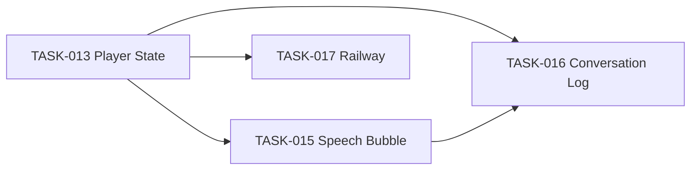

# Sprint 4 (Tasks 015–017) — Research and Implementation Plan

**Status:** Sprint 4 complete. All tasks DONE; see [sprint README](.ai/tasks/sprint-4-polish-deploy/README.md).

**Recommended order (completed):** 015 → 016 → 017.

---

## Progress summary

| Task         | Status | Delivered                                                                                                                                                                       |
| ------------ | ------ | ------------------------------------------------------------------------------------------------------------------------------------------------------------------------------- |
| **TASK-015** | DONE   | `npc-bubble.vue`, say skill `mode` + socket emit, `defaultSpeechMode`, content policy. Modal dialogue + emotion bubbles used in practice; bubble UI available.                  |
| **TASK-016** | DONE   | User messages in memory with `playerId`; `getConversationsForPlayer()`; `conversation-log.vue` (L key); data persisted to Supabase. In-game panel optional; data for dashboard. |
| **TASK-017** | DONE   | `railway.toml`, `main/server.ts` /health, Dockerfile PORT + HEALTHCHECK, `engines.node` 18. Verified: build passes, /health returns 200.                                        |

**Verification:** `npm run build` passes. Game logs show Supabase flush, idle/onAction, say skill, one handled 429. Next: human deploys to Railway (env vars, deploy), then optional follow-ups below.

---

## Next steps (optional / future)

1. **Railway deploy:** Create project, set MOONSHOT_API_KEY, SUPABASE_*, NODE_ENV, deploy from repo. Verify /health and game load in browser.
2. **Dashboard:** Consume conversation data from Supabase `agent_memory` (or an API wrapping `getConversationsForPlayer`) for monitoring view.
3. **Speech bubbles (optional):** If enabling bubble mode in-game, ensure sprite-attached GUIs are shown for NPC sprites (RPGJS tooltip/attach flow); current code emits `npc-bubble:show` to all clients.
4. **Sprint 5:** Proceed to [sprint-5-api-identity-social](.ai/tasks/sprint-5-api-identity-social/) (TASK-018, TASK-019) when ready.

---

## 1. TASK-015: NPC Speech Bubble GUI

**Goal:** Floating speech bubble above NPC sprite (non-blocking), with `say` skill supporting `mode: 'modal' | 'bubble'` and event-based defaults.

### Current state (verified)

- [say.ts](src/agents/skills/skills/say.ts): Only modal path via `targetPlayer.showText()`; no `mode` parameter.
- [types.ts](src/agents/skills/types.ts): `GameContext` has no `defaultSpeechMode`.
- [AgentNpcEvent.ts](main/events/AgentNpcEvent.ts): `buildRunContext()` builds `gameContext` (lines 118–124) but does not set `defaultSpeechMode`.
- RPGJS reference: [tooltip.vue](docs/rpgjs-reference/packages/sample2/main/gui/tooltip.vue) shows `rpgAttachToSprite: true` + `props: ['spriteData']`; [GuiManager.ts](docs/rpgjs-reference/packages/server/src/Player/GuiManager.ts) uses `gui.tooltip` with `{ players, display }` (player-centric). For NPC bubbles we need a **custom socket event** to send message content (RPGJS tooltip only toggles display, not payload).

### Implementation summary

| Item                                                        | Action                                                                                                                                                                                                                                                                                                                                                                                                                       |
| ----------------------------------------------------------- | ---------------------------------------------------------------------------------------------------------------------------------------------------------------------------------------------------------------------------------------------------------------------------------------------------------------------------------------------------------------------------------------------------------------------------- |
| **Create** `main/gui/npc-bubble.vue`                        | Vue component: `rpgAttachToSprite: true`, `inject: ['rpgScene']`, `props: ['spriteData']`. In `mounted()`, get live sprite via `this.rpgScene().getSprite(this.spriteData.id)` and subscribe to a **client-side** socket event (e.g. `npc-bubble:show`) with payload `{ spriteId, npcName, message }`. When `spriteId === this.spriteData.id`, call `showMessage(npcName, message)`. Auto-fade after ~3.5s, clear after ~4s. |
| **Server → client**                                         | Say skill (bubble path) must emit to **all clients** (or to the relevant player’s socket) so the correct Vue instance can show the bubble. Use the **server’s Socket.IO** (e.g. from `RpgServerEngine` or the player’s socket) to emit `npc-bubble:show` with `{ spriteId: context.event.id, npcName: context.agentId, message }`. Research where server gets the socket/io instance (e.g. from engine or player).           |
| **Modify** [say.ts](src/agents/skills/skills/say.ts)        | Add `mode` parameter (`enum: ['modal', 'bubble']`). If `mode === 'bubble'`: run content blocklist check, then emit bubble via socket (no `showText`). Otherwise keep existing modal `showText` path. Use `context.defaultSpeechMode ?? 'modal'` when `mode` is omitted.                                                                                                                                                      |
| **Modify** [types.ts](src/agents/skills/types.ts)           | Add `defaultSpeechMode?: 'modal'                                                                                                                                                                                                                                                                                                                                                                                             |
| **Modify** [AgentNpcEvent.ts](main/events/AgentNpcEvent.ts) | In `buildRunContext()`, set `defaultSpeechMode: event.type === 'player_action' ? 'modal' : 'bubble'` on `gameContext`.                                                                                                                                                                                                                                                                                                       |
| **Content policy**                                          | Add simple blocklist check in say skill before display; add rule to system prompt (per task spec).                                                                                                                                                                                                                                                                                                                           |

### Server socket emission

- The say skill runs in server context with `context.event` (RpgEvent). The server must emit to clients. Options: (1) Get global `io` from RPGJS server engine and `io.emit('npc-bubble:show', { spriteId, npcName, message })`, or (2) Emit to each player’s socket (e.g. iterate players on the same map and emit to each). Implementation should look up how RPGJS exposes the Socket.IO server (e.g. in [express/server.ts](docs/rpgjs-reference/packages/server/src/express/server.ts) or engine) and use that for a custom event.

### Key files

- Create: `main/gui/npc-bubble.vue`
- Modify: `src/agents/skills/skills/say.ts`, `src/agents/skills/types.ts`, `main/events/AgentNpcEvent.ts`
- Reference: `docs/rpgjs-reference/docs/gui/tooltip.md`, `docs/rpgjs-reference/packages/server/src/Player/GuiManager.ts`, `docs/rpgjs-reference/packages/client/src/Gui/Gui.ts` (socket events)

---

## 2. TASK-016: Agent Conversation Log GUI

**Goal:** Side panel (keybind `L`) showing conversation history per NPC, non-blocking, data from agent memory.

### Current state (verified)

- [IAgentMemory](src/agents/memory/types.ts): Already defines `getAllMessages(): ReadonlyArray<MemoryEntry>` (line 137). [InMemoryAgentMemory](src/agents/memory/InMemoryAgentMemory.ts) and [SupabaseAgentMemory](src/agents/memory/SupabaseAgentMemory.ts) implement it.
- [AgentRunner](src/agents/core/AgentRunner.ts): Only **assistant** replies are stored in memory (`memory.addMessage({ role: 'assistant', ... })` at 234). The synthetic **user** message (`eventToUserMessage(event)`) is sent to the LLM but **not** stored. So conversation log would currently show only NPC lines unless we also store user messages.

### Gap to fix for TASK-016

- **Store user messages with `playerId`:** In `AgentRunner.run()`, after building the user message for the LLM, add `this.memory.addMessage({ role: 'user', content: eventToUserMessage(event), timestamp: Date.now(), metadata: { playerId: event.player?.id } })` so `getConversationsForPlayer(playerId)` can filter correctly. For `idle_tick` there is no player; either omit metadata or use a sentinel — task says filter “user messages from this player + assistant”; idle messages can be excluded or shown for “system” context depending on product choice (task says “only user and assistant,” so keep it simple: only store user message when `event.player` exists if we want strict per-player filtering).

### Implementation summary

| Item                                                          | Action                                                                                                                                                                                                                                                    |
| ------------------------------------------------------------- | --------------------------------------------------------------------------------------------------------------------------------------------------------------------------------------------------------------------------------------------------------- |
| **Create** `main/gui/conversation-log.vue`                    | Side panel: header, NPC tabs (“All” + one per NPC), scrollable message list (newest first). Use `inject: ['rpgGuiClose', 'rpgKeypress']`, `props: ['conversations']`. On `rpgKeypress` for `conversation-log`, close panel (toggle). Style per task spec. |
| **Modify** [rpg.toml](rpg.toml)                               | Add `[inputs.conversation-log]` with `name = "conversation-log"`, `bind = "l"`.                                                                                                                                                                           |
| **Modify** [main/player.ts](main/player.ts)                   | In `onInput()`, when `input === 'conversation-log'`: get `agentManager.getConversationsForPlayer(player.id)`, open `player.gui('conversation-log')` with `{ conversations }` and `{ blockPlayerInput: false }`.                                           |
| **Modify** [AgentManager.ts](src/agents/core/AgentManager.ts) | Add `getConversationsForPlayer(playerId: string): ConversationSnapshot[]`: iterate `this.agents`, for each agent get `agent.memory.getAllMessages()`, filter to entries where `(role === 'user' && metadata?.playerId === playerId)                       |
| **Optional** [AgentRunner.ts](src/agents/core/AgentRunner.ts) | Add `memory.addMessage` for the event-driven user message with `metadata: { playerId: event.player?.id }` when `event.player` is present, so conversation log has both sides.                                                                             |

### Key files

- Create: `main/gui/conversation-log.vue`
- Modify: `rpg.toml`, `main/player.ts`, `src/agents/core/AgentManager.ts`; optionally `src/agents/core/AgentRunner.ts` for user message storage
- Reference: [TASK-016](.ai/tasks/sprint-4-polish-deploy/TASK-016.md) (full Vue template and types in task), `main/gui/builder-dashboard.vue`, `src/agents/memory/types.ts`

---

## 3. TASK-017: Deploy to Railway

**Goal:** Production deployment with health check, correct PORT, and Docker HEALTHCHECK.

### Current state (verified)

- **main/server.ts:** Does **not** exist (create from scratch).
- **Dockerfile:** Exists (~15 lines); no `HEALTHCHECK`, no `PORT` env; `EXPOSE 3000` and `CMD npm start`.
- **package.json:** `engines` is `">=14"`; task requires `"18"`. Start script: `node dist/server/main.mjs`.
- RPGJS: [express/server.ts](docs/rpgjs-reference/packages/server/src/express/server.ts) sets `rpgGame.app = app` and uses `process.env.PORT \|\| config.port \|\| 3000` — no code change needed for PORT if Railway sets `PORT`.

### Implementation summary

| Item                        | Action                                                                                                                                                                              |
| --------------------------- | ----------------------------------------------------------------------------------------------------------------------------------------------------------------------------------- |
| **Create** `railway.toml`   | Per task: `[build]` DOCKERFILE, `[deploy]` startCommand, healthcheckPath `/health`, restart policy.                                                                                 |
| **Create** `main/server.ts` | Default export with `onStart(engine)`: get `app = engine.app`, register `app.get('/health', ...)` returning `{ status: 'ok', uptime, timestamp }`. Log or warn if `app` is missing. |
| **Modify** Dockerfile       | Add `ENV PORT=3000`, `EXPOSE $PORT`, and `HEALTHCHECK` using `wget` (alpine) against `http://localhost:${PORT}/health`.                                                             |
| **Modify** package.json     | Set `engines.node` to `"18"`.                                                                                                                                                       |

CORS: Leave default for MVP (no change). Human sets env vars in Railway dashboard (MOONSHOT_API_KEY, SUPABASE_*, NODE_ENV); do not hardcode secrets.

### Key files

- Create: `railway.toml`, `main/server.ts`
- Modify: `Dockerfile`, `package.json`
- Reference: [TASK-017](.ai/tasks/sprint-4-polish-deploy/TASK-017.md), [express/server.ts](docs/rpgjs-reference/packages/server/src/express/server.ts)

---

## 4. Dependency and order

- **015** depends on TASK-007 (Skill System) and TASK-009 (Bridge) — already done. No dependency on 013 for code; 013 is sprint ordering.
- **016** depends on TASK-008 (AgentRunner memory) and TASK-012 (Supabase memory) — done. `getAllMessages()` exists; add user-message storage in AgentRunner if we want full conversation history per player.
- **017** depends on TASK-012 and TASK-014 (AgentManager) — done. No `main/server.ts` today; create it.

---

## 5. Verification (all tasks)

- Run `rpgjs build` and `npx tsc --noEmit` after each task.
- 015: Bubble appears above NPC, say skill has modal/bubble modes, defaults by event type.
- 016: `L` opens/closes panel, data from `getConversationsForPlayer`, non-blocking.
- 017: `/health` returns 200, Docker build and start succeed, `PORT` and HEALTHCHECK in place.

