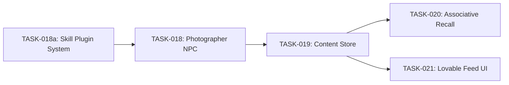

# Sprint 5: Modular Skill Plugin Architecture Integration

## Context

The architecture brief at `[.ai/briefs/modular-skill-plugin-architecture.md](.ai/briefs/modular-skill-plugin-architecture.md)` proposes refactoring the hardcoded `skillMap` in `[src/agents/core/AgentManager.ts](src/agents/core/AgentManager.ts)` (lines 116-138) into a modular plugin system before building the Photographer NPC. This plan integrates that proposal into the sprint structure.

**Boundary note**: These files are in `.ai/` (normally Claude Code's domain). This is a PM-directed cross-boundary action; each file will carry a note to that effect.

---

## Architectural Decisions (Answering Brief's 5 Questions)

- **Q1 Task Split**: Split into TASK-018a (infra) + updated TASK-018 (photographer). Confirmed by PM.
- **Q2 Inventory Schema**: Simple `string[]` for MVP. Item-skill binding lives in the `SkillPlugin` definition, not the YAML config. Structured objects deferred.
- **Q3 Discovery Mechanism**: Enhanced barrel file with explicit `skillPlugin` exports (static imports). Truly dynamic `fs.readdirSync` deferred -- TypeScript build safety first.
- **Q4 Idea Docs**: New idea doc `14-modular-skill-plugin-architecture.md` (don't overwrite existing 08/08a).
- **Q5 Sprint Scope**: TASK-018a adds ~1 session of work. Reduces implementation time for TASK-018 and all future API NPCs. No impact on TASK-019/020/021 timeline.

---

## Revised Sprint 5 Task Order

- **TASK-018a** (NEW): Modular Skill Plugin System -- infra refactor, ~100 lines
- **TASK-018** (UPDATED): Photographer NPC -- now depends on 018a, scope reduced
- **TASK-019**: Content Store + Tagging -- unchanged, `create_post` uses plugin system
- **TASK-020**: Associative Recall -- unchanged
- **TASK-021**: Lovable Feed UI -- unchanged

---

## Files to Create

### 1. New Idea Doc: `[.ai/idea/14-modular-skill-plugin-architecture.md](.ai/idea/14-modular-skill-plugin-architecture.md)`

Distilled from the architecture brief. Covers:

- The Problem (hardcoded skillMap)
- MCP-inspired mental model (Discovery, Scoping, Capability Negotiation)
- Three-layer architecture (plugin auto-registration, item-gated access, in-character failures)
- `SkillPlugin` interface definition
- `SkillDependencies` interface
- Narrative alignment with Artel's Arcanum
- What to build now vs. later (map context, builder UI, rate limiting, item trading)
- Reference to brief at `.ai/briefs/modular-skill-plugin-architecture.md` for full detail

### 2. New Task Brief: `[.ai/tasks/sprint-5-api-identity-social/TASK-018a.md](.ai/tasks/sprint-5-api-identity-social/TASK-018a.md)`

Following the template at `[.ai/templates/task.md](.ai/templates/task.md)`:

- **Status**: PENDING
- **Assigned**: cursor
- **Priority**: P1-High
- **Type**: Refactor + Create
- **Depends on**: TASK-007 (Skill System), TASK-014 (AgentManager)
- **Blocks**: TASK-018 (Photographer NPC), all future API-backed NPCs

**Scope** (from brief "What to Build Now" section 1 + 3):

Create files:

- `src/agents/skills/plugin.ts` -- `SkillPlugin` and `SkillDependencies` type definitions
- `src/agents/skills/discovery.ts` -- `discoverSkillPlugins()` function that builds plugin map from barrel exports
- `main/database/items/ImageGenToken.ts` -- RPGJS database item

Modify files:

- `src/agents/core/AgentManager.ts` -- replace hardcoded `skillMap` with plugin-driven registration; add inventory support at spawn
- `src/agents/core/types.ts` -- add optional `inventory: string[]` to `AgentConfig`
- `src/agents/skills/skills/move.ts` -- add `skillPlugin` export
- `src/agents/skills/skills/say.ts` -- add `skillPlugin` export
- `src/agents/skills/skills/look.ts` -- add `skillPlugin` export
- `src/agents/skills/skills/emote.ts` -- add `skillPlugin` export
- `src/agents/skills/skills/wait.ts` -- add `skillPlugin` export
- `src/agents/skills/index.ts` -- re-export plugin types + all `skillPlugin` objects

Acceptance criteria:

- `SkillPlugin` interface defined with name, create, requiredItem, requiresEnv, category
- All 5 existing skills export `skillPlugin` objects
- `discoverSkillPlugins()` builds complete skill map from barrel exports
- `AgentManager.registerSkillsFromConfig()` uses discovered plugins (no hardcoded map)
- `AgentConfig` supports optional `inventory: string[]`
- `spawnAgentsOnMap()` calls `addItem()` for each inventory entry
- `ImageGenToken` database item exists and autoloads
- Elder Theron still works identically (backward compatible)
- `rpgjs build` and `npx tsc --noEmit` pass

---

## Files to Update

### 3. Update TASK-018: `[.ai/tasks/sprint-5-api-identity-social/TASK-018.md](.ai/tasks/sprint-5-api-identity-social/TASK-018.md)`

Changes:

- Add **Depends on**: TASK-018a (Modular Skill Plugin System)
- Remove plugin infra scope (now in 018a): no `SkillPlugin` types, no discovery function, no existing skill modifications, no `AgentConfig.inventory` changes, no `ImageGenToken` item
- Keep: `generate-image.ts` skill with `skillPlugin` export, `photographer-clara.yaml`, Gemini API integration, `.env.example` update, all acceptance criteria related to Photographer behavior
- Add note: "TASK-018a provides the plugin infrastructure and inventory support this task uses"
- Add: "New dependency: `@google/generative-ai` (approved by PM)"

### 4. Update Sprint README: `[.ai/tasks/sprint-5-api-identity-social/README.md](.ai/tasks/sprint-5-api-identity-social/README.md)`

Add TASK-018a row to the task table. Update recommended order to: 018a -> 018 -> 019 -> 020+021.

### 5. Update Status: `[.ai/status.md](.ai/status.md)`

Add TASK-018a to Sprint 5 table. Add note about the architecture brief and PM-directed sprint revision.

### 6. Update Idea Index: `[.ai/idea/INDEX.md](.ai/idea/INDEX.md)`

Add `14-modular-skill-plugin-architecture.md` to the Feature Ideas section with description: "MCP-inspired modular skill plugin system: auto-discovery, item-gated API access, in-character capability negotiation."