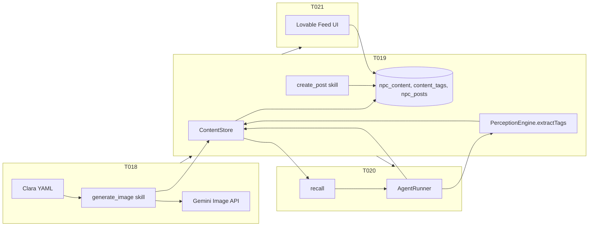

# Sprint 5 — API-as-Identity + Social + Memory: Research and Plan

## 1. Research Findings

### 1.1 Task Dependency Chain

Sprint 5 has a strict dependency order:

- **TASK-018** (Photographer NPC + Image Generation Skill) — Depends on TASK-007 (Skill System), TASK-014 (AgentManager). **No Sprint 5 deps.** Unblocks TASK-019.
- **TASK-019** (NPC Content Store + Semantic Tagging + Social Posts) — Depends on **TASK-012** (Supabase client), **TASK-018** (generate_image). Blocks TASK-020 and TASK-021.
- **TASK-020** (Associative Recall + Environment-Driven Memory) — Depends on **TASK-019** (ContentStore + tagging). Modify-only (AgentRunner, ContentStore).
- **TASK-021** (Lovable Feed UI + Instagram Bridge) — Depends on **TASK-019** (npc_posts table). **Assigned to Lovable** (frontend); no game-server changes.

**Recommended execution order:** 018 → 019 → then 020 and 021 in parallel (020 = cursor, 021 = lovable).

### 1.2 Codebase Verification

**Skills and registration**

- [SkillRegistry](src/agents/skills/SkillRegistry.ts) and [AgentManager.registerSkillsFromConfig](src/agents/core/AgentManager.ts) (lines 116–137) use a `skillMap` of name → skill or factory. Add `generate_image` and `create_post` to this map.
- [GameContext](src/agents/skills/types.ts) already has `nearbyPlayers`, `event`, `agentId`, `position`, `map` — sufficient for generate_image (target player) and create_post (agentId).
- Skill interface: [IAgentSkill, SkillResult, GameContext](src/agents/skills/types.ts). Existing skills: [say.ts](src/agents/skills/skills/say.ts) (uses `context.nearbyPlayers[0]?.player`) is the pattern to follow.

**Supabase and migrations**

- [getSupabaseClient](src/config/supabase.ts) returns a singleton or null; graceful degradation is the established pattern.
- Only one migration exists: [001_agent_memory.sql](supabase/migrations/001_agent_memory.sql). TASK-019 adds `003_npc_content.sql` (npc_content, content_tags, npc_posts).

**Perception and recall**

- [PerceptionEngine](src/agents/perception/PerceptionEngine.ts) has no `extractTags()`. [PerceptionSnapshot](src/agents/perception/types.ts) has `entities`, `location` (with `map`: MapInfo), `summary`, `timestamp` — **no `time` or `nearby**`. For extractTags:
  - Use `snapshot.entities` (not `nearby`) and `snapshot.location.map.id` or `snapshot.location.map.name` for location.
  - Optional: add a simple `time` to the snapshot (e.g. derived from `timestamp`) or omit for MVP; task spec says `tags.push(snapshot.time)` — if omitted, document in handoff.
- [AgentRunner.run](src/agents/core/AgentRunner.ts) (lines 112–127): get context → generate snapshot → **buildSystemPrompt(snapshot)** → LLM. Recall injection belongs **before** buildSystemPrompt: get snapshot → extract tags → ContentStore.recall() → inject “Your Memories” into system prompt. [buildSystemPrompt](src/agents/core/AgentRunner.ts) (74–109) currently has: Identity, World, Skills, Recent context, Rules, Current state. Insert “Your Memories” between World and Recent context (or after World as in task).

**Agent config and spawn**

- [AgentConfig](src/agents/core/types.ts) has no `startingInventory`. TASK-018 requires giving Clara the ImageGenToken at spawn. Options: (1) Add optional `startingInventory?: string[]` to AgentConfig and [parseAgentConfig](src/agents/core/AgentManager.ts) (63–112), and in [AgentNpcEvent.onInit](main/events/AgentNpcEvent.ts) grant items via `this.addItem('image-gen-token')` if the event API supports it; or (2) document that RpgEvent must support addItem (RPGJS reference shows `event.addItem(FireWeapon)` in elements.spec).
- [AgentNpcEvent](main/events/AgentNpcEvent.ts) is the generic YAML-driven event; photographer-clara.yaml will spawn this event type at config spawn. The existing [photographer.ts](main/events/photographer.ts) is a **scripted** non-AI NPC; both can coexist (Clara = AI, current photographer = scripted).

**Database items**

- No `main/database/` folder found; RPGJS autoload expects database under module (e.g. [main/](main/)). Task specifies `main/database/ImageGenToken.ts`. Per [rpgjs-guide](docs/rpgjs-guide.md), `database/items/Potion.ts` is the pattern — confirm whether the task’s `main/database/ImageGenToken.ts` (file at root of database) is correct or should be `main/database/items/ImageGenToken.ts` per convention.

### 1.3 Gaps and Risks (from idea docs)

- **12-unified-system-synthesis.md** (P0): “Supabase Storage for images” — add to TASK-018 or follow-up; Generated image URLs may expire, so MVP stores URL in player variable and in npc_content; persistent images = Supabase Storage later. We use Gemini for image (and eventually video/sound) generation; Kimi for chat only.
- **12-unified-system-synthesis.md** (P1): “Tag normalization” — add to TASK-019 or later; MVP uses free-form tags.
- **TASK-018**: Rate limiting is explicitly out of scope (“add as separate issue/task”); 10s timeout and in-character errors are in scope.
- **TASK-021**: Real Instagram API is deferred; feed UI only needs `approved` and `posted_externally` flags.

### 1.4 TASK-021 (Lovable) Scope

- Feed page: grid of NPC posts from Supabase `npc_posts` + join `npc_content` (image URL, caption, npc_name, likes, approved).
- Like button: update `likes` and `approved: true`.
- Filter by NPC (agent_id).
- Mobile-responsive; empty state; Supabase anon key + RLS for read and limited write. No game server or RPGJS changes.

---

## 2. Sources

| Topic                                       | Source                                                                                                                             |
| ------------------------------------------- | ---------------------------------------------------------------------------------------------------------------------------------- |
| Task specs                                  | [.ai/tasks/sprint-5-api-identity-social/](.ai/tasks/sprint-5-api-identity-social/) — TASK-018, 019, 020, 021, README               |
| API-as-Identity vision                      | [.ai/idea/08-api-as-identity-npcs.md](.ai/idea/08-api-as-identity-npcs.md)                                                         |
| Implementation (Gemini image + Clara)      | [.ai/idea/08a-api-powered-skills-implementation-plan.md](.ai/idea/08a-api-powered-skills-implementation-plan.md)                   |
| Social + memory vision                      | [.ai/idea/09-npc-social-memory-fragments.md](.ai/idea/09-npc-social-memory-fragments.md)                                           |
| Implementation (ContentStore, recall, feed) | [.ai/idea/09a-social-memory-fragments-implementation-plan.md](.ai/idea/09a-social-memory-fragments-implementation-plan.md)         |
| Gaps and priorities                         | [.ai/idea/12-unified-system-synthesis.md](.ai/idea/12-unified-system-synthesis.md) (P0/P1 table)                                   |
| System narrative                            | [.ai/idea/13-complete-system-narrative.md](.ai/idea/13-complete-system-narrative.md)                                               |
| Skill system                                | [src/agents/skills/](src/agents/skills/) — types, SkillRegistry, say.ts                                                            |
| Agent core                                  | [src/agents/core/AgentRunner.ts](src/agents/core/AgentRunner.ts), [AgentManager.ts](src/agents/core/AgentManager.ts)               |
| Perception                                  | [src/agents/perception/PerceptionEngine.ts](src/agents/perception/PerceptionEngine.ts), [types.ts](src/agents/perception/types.ts) |
| Supabase                                    | [src/config/supabase.ts](src/config/supabase.ts), [001_agent_memory.sql](supabase/migrations/001_agent_memory.sql)                 |
| Bridge and spawn                            | [main/events/AgentNpcEvent.ts](main/events/AgentNpcEvent.ts), [spawnContext.ts](src/agents/core/spawnContext.ts)                   |

---

## 3. Recommendations

1. **Order:** Implement 018 first, then 019. After 019, 020 (cursor) and 021 (lovable) can proceed in parallel.
2. **TASK-018:** Add optional `startingInventory` to AgentConfig and grant items in AgentNpcEvent.onInit; verify RpgEvent addItem/hasItem (by id string) in RPGJS version in use. Create `main/database/` (or `main/database/items/`) and ImageGenToken; register generate_image in AgentManager skillMap; lazy-init **Gemini** client for image generation (`GEMINI_API_KEY`); 10s timeout and content-policy handling as specified. We use Gemini for all image/video/sound generation; Kimi for chat only.
3. **TASK-019:** Add migration 003_npc_content.sql; implement ContentStore (storeContent, recall with relevance, createPost, getRecentPosts); add PerceptionEngine.extractTags() using snapshot.entities and location.map (and optional time if added); wire generate_image to store content + tags after success; add create_post skill and register it; keep graceful Supabase fallback.
4. **TASK-020:** Inject recall in AgentRunner after snapshot, before buildSystemPrompt: extractTags → recall(agentId, tags, 3) → format “Your Memories” section → pass into buildSystemPrompt (or extend buildSystemPrompt to accept optional recall block). Ensure ContentStore.recall returns relevance; handle null/empty ContentStore gracefully.
5. **TASK-021 (Lovable):** Implement feed UI against Supabase npc_posts + npc_content; like/approve and filter by agent_id; ensure RLS allows anon read and controlled write for likes/approved; leave Instagram API for a later task.
6. **Perception “time”:** Either add an optional `time` field to PerceptionSnapshot (e.g. “morning”/“afternoon” from timestamp) for richer tags, or omit and use only map + entities in extractTags for MVP; document in TASK-019 handoff.
7. **Database path:** Confirm with RPGJS autoload whether item belongs in `main/database/ImageGenToken.ts` or `main/database/items/ImageGenToken.ts` and align task if needed.

---

## 4. Architecture Snapshot (Sprint 5)

---

## 5. Implementation Todos (High Level)

- **018:** ImageGenToken item, generate_image skill, OpenAI client, photographer-clara.yaml, skill registration, startingInventory + spawn grant.
- **019:** Migration 003, ContentStore, extractTags, generate_image → storeContent, create_post skill and registration.
- **020:** AgentRunner recall injection, ContentStore.recall relevance, graceful no-ContentStore path.
- **021:** Lovable feed page, post cards, like/approve, filter by NPC, RLS, mobile layout.

