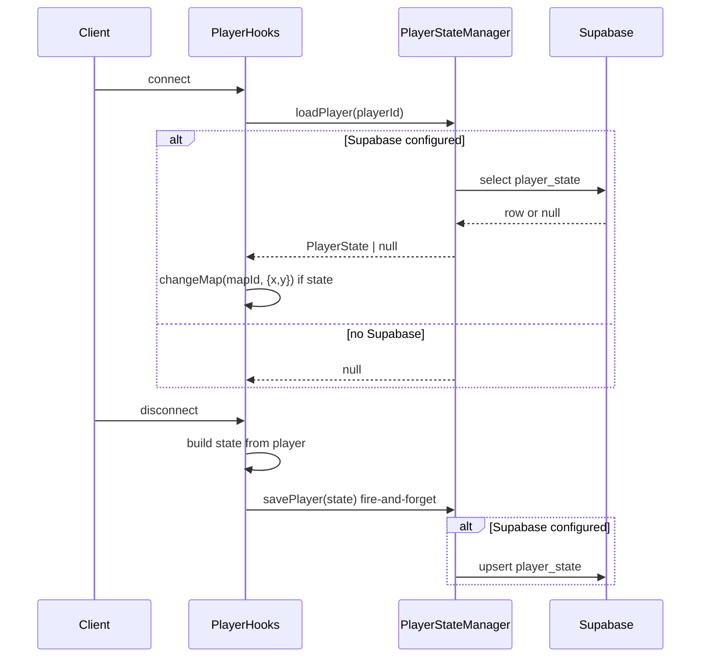

# TASK-013: Player State Persistence via Supabase — Implementation Plan

## Goal

Players keep position and state across tab close or server restart. Save on disconnect, restore on connect, using the existing Supabase client from TASK-012. No use of `@rpgjs/save` (client-side localStorage).

## Architecture

## 1. Database migration

**Create** [supabase/migrations/002_player_state.sql](supabase/migrations/002_player_state.sql)

- Table `player_state`: `player_id` (text PK), `name`, `map_id`, `position_x`, `position_y`, `direction` (smallint default 0), `state_data` (jsonb default '{}'), `created_at`, `updated_at`.
- Trigger to auto-update `updated_at` via `update_timestamp()` (use `create or replace function` so the migration is idempotent; [001_agent_memory.sql](supabase/migrations/001_agent_memory.sql) does not define this function).
- Optional: `comment on table player_state` for documentation.

Run manually in Supabase SQL Editor or via `supabase db push`; no change to app startup.

## 2. PlayerStateManager and types

**Create** [src/persistence/PlayerStateManager.ts](src/persistence/PlayerStateManager.ts) (~80–100 lines)

- **Interface** `PlayerState`: `playerId`, `name`, `mapId`, `positionX`, `positionY`, `direction`, `stateData: Record<string, unknown>` (camelCase to match task; map to snake_case for DB).
- **Constructor / factory**: Accept `SupabaseClient | null`. If null, all methods no-op / return null and never throw.
- **savePlayer(state)**: Upsert into `player_state` (map camelCase to snake_case). Log errors, never throw. Return `Promise<void>`.
- **loadPlayer(playerId)**: Select by `player_id`, return `Promise<PlayerState | null>`. On error or not found, return null; log errors.
- **deletePlayer(playerId)**: Delete by `player_id`; log errors, never throw.
- Use a single `[PlayerState]` log prefix. Get client via parameter (caller passes `getSupabaseClient()`), so the manager stays testable and doesn’t import config.

**Create** [src/persistence/index.ts](src/persistence/index.ts)

- Export `PlayerState`, `PlayerStateManager`, and a small factory that takes `getSupabaseClient()` and returns a `PlayerStateManager` instance (or a singleton manager instance created with `getSupabaseClient()`). Callers in `main/player.ts` will use this so that when Supabase is unavailable the manager still exists and no-ops.

## 3. Player hooks in main/player.ts

**File** [main/player.ts](main/player.ts)

- **Import**: `getSupabaseClient` from `@/config/supabase` (or `../src/config/supabase`), and the persistence factory / `PlayerStateManager` + `PlayerState` from `@/persistence` (or `../src/persistence`). Create one manager instance at module load: `const playerStateManager = createPlayerStateManager(getSupabaseClient)` (or equivalent) so that missing Supabase simply yields a no-op manager.
- **onConnected**: After existing setup (name, setComponentsTop, LLM test), call `playerStateManager.loadPlayer(player.id)`. If result is non-null and `result.mapId` is set, call `await player.changeMap(result.mapId, { x: result.positionX, y: result.positionY })` inside try/catch; on error (e.g. map not found), log and leave default spawn. Optionally set `player.name = result.name` when restoring. If load returns null or Supabase is unavailable, do nothing (default spawn stays).
- **onDisconnected**: New hook. Build state from `player`: `getCurrentMap()`, `player.id`, `player.name`, `player.position.x/y`, `player.direction` (or 0). Call `playerStateManager.savePlayer(state).catch(err => console.error('[PlayerState] save on disconnect failed:', err))` — fire-and-forget, no await, so disconnect is not blocked.
- **Graceful degradation**: If `getSupabaseClient()` is null, the manager already no-ops (load returns null, save does nothing). No extra branches in player.ts beyond using the manager.

## 4. Edge cases and acceptance

- **Map missing**: If `changeMap(savedMapId, ...)` fails or returns null (e.g. map removed), catch, log, and do not rethrow; player keeps default spawn.
- **Supabase down**: Manager returns null on load and skips save; no crash.
- **state_data**: MVP store `{}` only; do not store secrets (document in code or migration comment).
- **Direction**: Persist and restore if RPGJS exposes direction on `RpgPlayer`; otherwise persist 0 and skip restore for direction.

Verification: `rpgjs build` and `npx tsc --noEmit` pass; manual test: move player, refresh browser, confirm same map/position.

## 5. Files summary

| Action | Path                                                        |
| ------ | ----------------------------------------------------------- |
| Create | `supabase/migrations/002_player_state.sql`                  |
| Create | `src/persistence/PlayerStateManager.ts`                     |
| Create | `src/persistence/index.ts`                                  |
| Modify | `main/player.ts` (onConnected restore, onDisconnected save) |

## 6. Do not

- Use `@rpgjs/save` or client-side localStorage.
- Store sensitive data in `state_data`.
- Add auth or user accounts.
- Change [src/config/supabase.ts](src/config/supabase.ts).
- Auto-save on a timer (save only on disconnect).
- Let save/load or missing map crash the server; all errors must be caught and logged.

