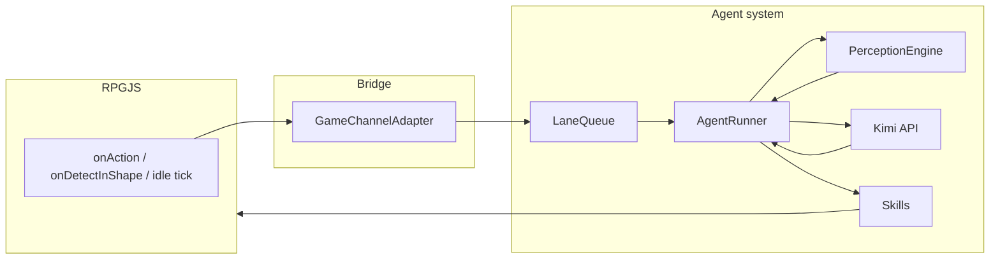

# Open-RPG

RPGJS v4 game where AI agents live as NPC characters — they perceive through game events, act through game commands (skills), and use an in-repo agent system powered by the Moonshot (Kimi) API.

---

## What this repo contains

- **RPGJS v4 game module** (`main/`) — maps, events (NPCs), GUIs, spritesheets, Tiled world assets
- **AI agent system** (`src/agents/`) — lane queue, agent runner, skills (move, say, look, emote, wait), perception engine, memory, bridge (RPGJS ↔ agent)
- **Supabase integration** — optional agent memory persistence and player state (migrations in `supabase/migrations/`)
- **Builder dashboard** — in-game placement of AI and scripted NPCs (key **B**), conversation log (key **L**)

---

## Project status

**WIP / Experimental.** The agent system is implemented and working; roadmap and coordination live in `AGENTS.md` and `.ai/`.

---

## Quickstart

```bash
git clone https://github.com/AgentArtel/Open-RPG.git
cd Open-RPG
npm install
cp .env.example .env
```

Edit `.env` and set your Moonshot API key:

```
MOONSHOT_API_KEY=sk-your-actual-key-here
```

Start the dev server:

```bash
npm run dev
```

Open [http://localhost:3000](http://localhost:3000). You should see the game and the default map (`simplemap`). AI NPCs (e.g. Elder Theron) are spawned on the map; walk up and press the action key to talk. In the server console, look for `[Adapter:elder-theron]` and `[Adapter:elder-theron] success=true` to confirm the agent is processing.

---

## Environment variables

| Variable | Required | Description |
|--------|----------|-------------|
| `MOONSHOT_API_KEY` | Yes | Moonshot/Kimi API key. Get from [platform.moonshot.ai](https://platform.moonshot.ai/). Used for all LLM calls. |
| `KIMI_API_KEY` | No | Same key as `MOONSHOT_API_KEY`; fallback name used by some scripts. |
| `SUPABASE_URL` | For persistence | Supabase project URL. Used for agent memory and player state. |
| `SUPABASE_SERVICE_ROLE_KEY` | For persistence | Supabase service role key (Settings → API). |
| `PORT` | No | Server port (default 3000). |
| `KIMI_IDLE_MODEL` / `KIMI_CONVERSATION_MODEL` | No | Override LLM models (defaults from agent YAML). |

**Security:** Never use the `VITE_` prefix for API keys or secrets — that exposes them to the client. The `.env` file is gitignored.

---

## Commands

| Command | Description |
|---------|-------------|
| `npm run dev` | Start dev server (game + client with HMR). |
| `npm run build` | Production build (`rpgjs build`). |
| `npm start` | Run production server (`node dist/server/main.mjs`). |
| `npx tsc --noEmit` | Type check without emitting files. |

Run `npm run build` and `npx tsc --noEmit` before committing. There is no `npm run lint` script in this repo.

---

## Architecture overview

The agent system is **event-driven**: RPGJS hooks (player action, proximity, leave) and a **periodic idle tick** (~15s) feed into a per-NPC lane queue. The agent runner builds a perception snapshot, calls the LLM (Kimi via the OpenAI-compatible API), and executes skills (move, say, look, emote, wait). Results are applied in the game and stored in memory.



**Open-RPG / AI NPCs:** The agent system uses **OpenClaw-inspired patterns** (lane queue, agent runner, channel adapter, skill system, perception, memory) **extracted and reimplemented** in this repo. OpenClaw is **not** imported as a dependency. See `docs/openclaw-patterns.md` for the extraction rationale and pattern descriptions.

---

## Repo structure

```
main/                    # RPGJS autoload module (rpg.toml modules = ['./main'])
├── player.ts            # Player lifecycle, builder input handling
├── server.ts            # Server hooks, /health endpoint
├── events/              # NPCs: AgentNpcEvent, scripted NPCs, test NPCs
├── gui/                 # Vue: builder-dashboard, conversation-log, npc-bubble
├── maps/                # simplemap
├── spritesheets/        # characters
├── worlds/              # Tiled .tmx / .tsx assets
├── database/            # (empty)
└── sounds/              # (empty)

src/
├── agents/              # AI agent system
│   ├── core/            # AgentManager, AgentRunner, LLMClient, LaneQueue
│   ├── skills/          # SkillRegistry, move/say/look/emote/wait
│   ├── perception/      # PerceptionEngine (game state → text snapshot)
│   ├── memory/          # InMemory + Supabase-backed agent memory
│   └── bridge/          # Bridge, GameChannelAdapter (RPGJS ↔ agent)
└── config/
    ├── supabase.ts      # Supabase client
    └── agents/          # YAML agent configs (elder-theron, test-agent)

supabase/migrations/    # 001_agent_memory.sql, 002_player_state.sql
```

---

## Agent configuration

Agents are defined in YAML under `src/config/agents/`. Example (`elder-theron.yaml`):

```yaml
id: elder-theron
name: Elder Theron
graphic: female
personality: |
  You are Elder Theron, the wise village elder...
model:
  idle: kimi-k2-0711-preview
  conversation: kimi-k2-0711-preview
skills: [move, say, look, emote, wait]
spawn:
  map: simplemap
  x: 300
  y: 250
behavior:
  idleInterval: 20000
  patrolRadius: 3
  greetOnProximity: true
```

AgentManager loads these at startup and spawns AI NPCs on the configured map.

---

## Deployment

- **Railway:** `railway.toml` and `Dockerfile` are present. Build uses the Dockerfile; start command is `npm start`; health check hits `/health`.
- **Docker:** `docker build -t open-rpg .` then `docker run -p 3000:3000 open-rpg`. Requires env vars (e.g. `MOONSHOT_API_KEY`) at runtime.
- **Netlify / Vercel:** `netlify.toml` and `vercel.json` exist and target `dist/standalone` for static build output. The primary game server is a Node process; use Railway or Docker for the full stack.

---

## Troubleshooting

- **Node version:** This repo targets Node 18 (`package.json` engines, Dockerfile). Use `node --version` and switch to 18+ if builds or runtime fail.
- **Missing API key:** If NPCs don’t respond or the server logs LLM errors, ensure `MOONSHOT_API_KEY` is set in `.env` (or `KIMI_API_KEY`). Restart the dev server after changing `.env`.
- **Port in use:** Default is 3000. Set `PORT` in `.env` or when running `npm start` if 3000 is taken.

---

## Contributing

Before opening a PR:

1. Run `npm run build` and `npx tsc --noEmit` (no lint script is defined).
2. Follow conventions and ownership in `AGENTS.md` (Cursor vs Claude Code vs Kimi Overseer).

---

## License

Not yet specified. No LICENSE file exists at the repo root.

---

## Credits for sample package assets

### Sounds

[Davidvitas](https://www.davidvitas.com/portfolio/2016/5/12/rpg-music-pack)  
Attribution 4.0 International (CC BY 4.0) — https://creativecommons.org/licenses/by/4.0/deed.en

### Graphics

[Pipoya](https://pipoya.itch.io)

### Icons

https://game-icons.net
